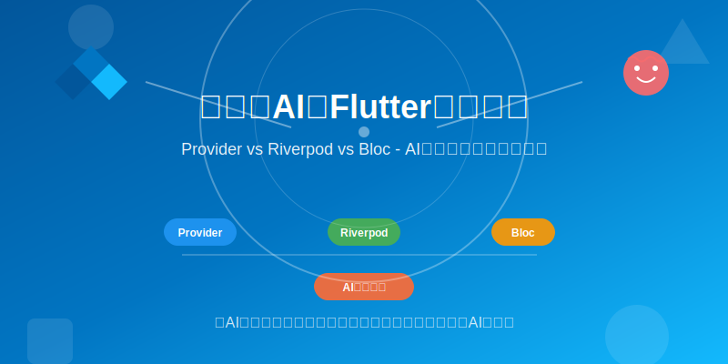
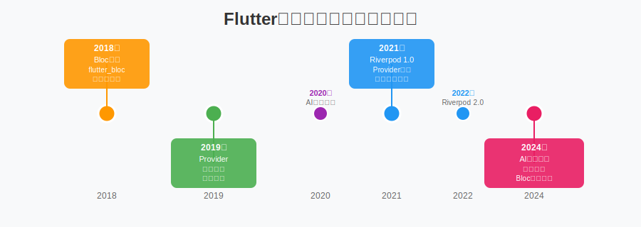
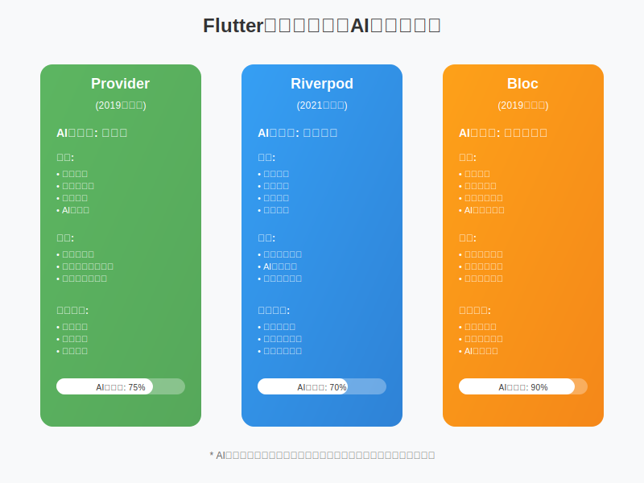
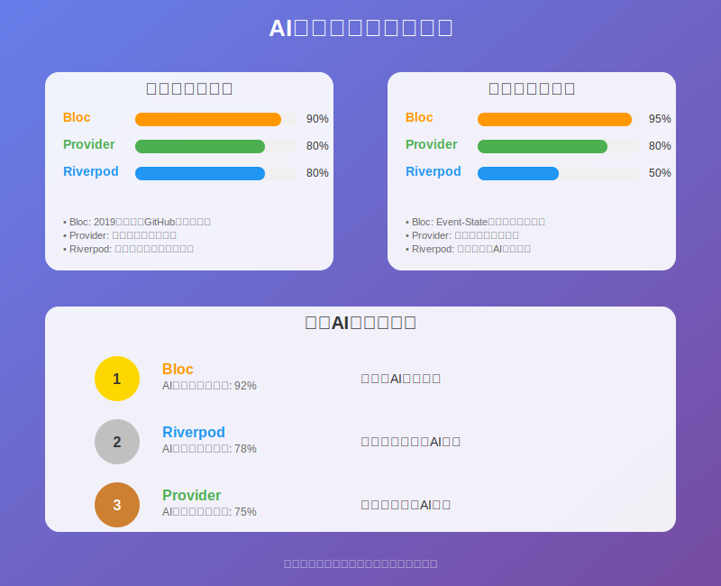
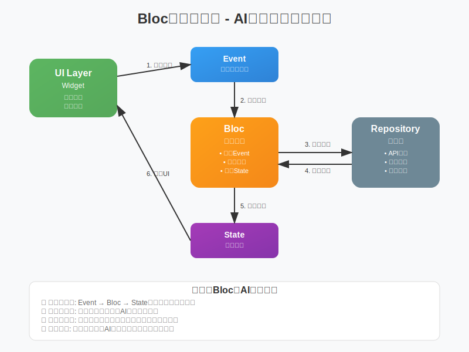

# 2025年Flutter状态管理新趋势：AI友好度成为技术选型第一标准



**哈喽，我是老刘**

老刘带着团队做Flutter开发已经六七年了，这期间被问到最多的三个问题是：
1. 跨平台开发选什么？
2. Flutter选哪个版本？
3. Flutter的状态管理方案有选哪个？

今天主要来聊聊状态管理方案的选择问题。

老刘自己的团队早期是小项目用Provider，中大型项目用Bloc。

最近这两年新项目主要还是用Riverpod比较多。

但是随着AI在开发中的比重越来越高，似乎Bloc重新成了更好的选择。

这不前两天，一个朋友跟我吐槽了一件让人哭笑不得的事。

他们团队把项目从Provider重构到Riverpod。

重构完成后，团队使用AI生成的Riverpod代码错误率提高了30%！

要么是注解用错了，要么是Provider依赖关系搞混了。

团队成员每天都在修AI的bug，效率反而比之前更低了。

为什么人类程序员觉得好用的技术，AI却"水土不服"？

因为我们的技术选型思维，还停留在"纯人工"时代。

在这个新时代，技术选型不能只看性能和优雅度。

"**AI友好度**"正在成为一个全新的、至关重要的评估标准。

今天，老刘就来聊聊Flutter状态管理的AI适配度问题。

首先我们来看看历史上Flutter官方推荐的状态管理方案。



## Flutter官方推荐的状态管理方案

### 1. Provider (2019年左右)

- 时间 ：大约2019年被Flutter官方推荐
- 特点 ：基于InheritedWidget的封装，Flutter官方文档推荐的入门方案
- 官方地位 ：Flutter官方文档明确推荐作为新手首选方案

### 2. Bloc/Cubit (2019年左右)

- 时间 ：flutter_bloc包发布于2018年
- 特点 ：基于BLoC（Business Logic Component）模式
- 官方认可 ：在Flutter官方文档中被列为推荐方案之一

### 3. Riverpod (2021年)

- 时间 ：2021年由Remi Rousselet发布1.0版本
- 特点 ：Provider的完全重写版本，解决了Provider的一些设计问题
- 发展 ：Riverpod 2.0在2022年发布，Riverpod 3.0在2024年9月发布

## 三大状态管理方案的"AI适配度"大PK

**AI适配度**是老刘自己提出来的一个概念，有两个主要指标：1、AI代码生成的成功率。 2、AI生成的代码对程序员是否友好（读得懂，好修改）。

因为老刘这边的主要场景还是AI和开发者协同工作。



### Provider：适合小型项目

从人类程序员的视角来看，Provider确实是简单易懂的"新手村神器"。

Flutter官方钦定的入门方案，学习成本低，上手快。

从AI的视角来看，Provider的代码也很容易生成和理解，但是自由度过高。

也就是说如果你让AI随意发挥，那么生成的代码和你们项目中的整体代码风格可能会有比较大的差异。

而且最大的问题是，小项目用Provider还行，但大项目往往需要二次封装来满足更多场景。

所以我认为，Provider适合小型项目，而且需要在使用中给AI明确的生成规则的限制。

### Riverpod：程序员的"白月光"，AI的"朱砂痣"

从人类程序员的角度，Riverpod功能强大，代码简洁，开发效率高。

这是Remi大神的"完美作品"，解决了Provider的诸多痛点。

但从AI的视角来看，Riverpod的注解魔法太多了。

代码生成逻辑复杂，AI"看不懂"那些@riverpod注解背后的门道。


### Bloc：AI时代的"扛把子"

从人类程序员的视角，Bloc确实代码略显冗长。

但结构清晰，是企业级项目的"老司机"。

从AI的视角来看，Bloc简直是"如鱼得水"。

Event-State模式高度标准化，训练数据丰富，AI"见多识广"。

Bloc的核心优势在于：

显式的代码结构，AI一眼就能看懂整个数据流。

## 为啥有些框架在AI开发中表现更好

说到这里，可能有朋友会问：为什么同样是状态管理方案，AI对它们的"理解能力"差这么多？

这背后其实有两个关键因素。



**第一个因素：训练数据的丰富度**

AI模型就像一个"见多识广"的老师傅。

它见过的代码越多，理解得就越深入。

Bloc在Flutter生态中存在时间最长，从2019年就开始积累大量的实际项目案例。

GitHub上你能找到成千上万个开源项目使用bloc。

这意味着AI在训练时接触到的Bloc代码样本最多，理解最深入。

相比之下，Riverpod虽然技术更先进，但2020年才发布，训练数据相对较少。

因此AI对Riverpod的"熟练度"自然不如Bloc。

**第二个因素：代码逻辑的直观性**

这个更关键。

AI的底层逻辑是模式匹配，所以最擅长处理的是"所见即所得"的代码结构。

Bloc的Event-State模式，所有的业务逻辑都明明白白写在代码里：

```dart
class CounterBloc extends Bloc<CounterEvent, CounterState> {
  CounterBloc() : super(CounterInitial()) {
    on<CounterIncrement>((event, emit) {
      emit(CounterValue(state.value + 1));
    });
  }
}
```

AI一看就懂：接收CounterIncrement事件，发出CounterValue状态。



但Riverpod的注解模式就不一样了：

```dart
@riverpod
Future<String> userProfile(UserProfileRef ref) async {
  // AI需要理解注解背后的代码生成逻辑
}
```

这个@riverpod注解对AI来说就是个"黑盒子"。

AI需要理解注解背后复杂的代码生成逻辑，理解成本大大增加。

简单来说，通过注解、依赖注入等方式组合的逻辑，容易让AI理解错误。

而所有逻辑都在代码中直观体现的方案，更有利于AI准确理解和生成代码。

GitHub上Bloc的案例最多，AI在训练时"见多识广"。

模式固定，AI生成代码的准确率最高。

根据我们团队的实际测试数据，使用Bloc的项目，AI代码生成准确率比Riverpod高30%。

这就是为什么在AI时代，Bloc重新成为了最佳选择。

## 避坑指南：不要盲目从Riverpod迁移到Bloc

但是，看到这里千万别急着把现有项目从Riverpod迁移到Bloc！

什么时候适合迁移？

项目页面还比较少，迁移成本不高的情况下。

比如你的项目只有5-10个页面，状态管理逻辑相对简单。

这种情况下，迁移成本可控，收益明显。

但如果你的项目已经有几十个页面，状态管理逻辑复杂。

那就别折腾了！

Riverpod在AI中只是表现得没有那么好，但也不是非常差。

Riverpod作为目前最流行的状态管理方案，可以找到大量的开源项目和案例。

这为AI提供了丰富的训练数据。

不迁移怎么办？

- 给AI提供标准的使用案例！
    比如准备一个包含完整业务逻辑的页面，让AI参照这个案例进行代码生成。
- 清晰地描述生成代码的规则和约定。

这样AI就能更准确地理解你的项目结构和编码风格。

事实上即使采用了Bloc，老刘也推荐采用上面的方式，让AI生成的代码符合你的项目规范。

## 总结：技术选型的新时代已经到来

### 拥抱AI，还是被AI抛弃？选择权在你手中

说到这里，老刘想跟大家分享一个观点。

在AI协同开发时代，"AI友好度"已经成为技术选型的新维度。

这不是什么玄学，而是实实在在的生产力指标。

老刘预测，未来3年内，不考虑AI协作的技术方案将逐渐被淘汰。

因为开发效率的差距会越来越明显。

一个AI友好的项目，开发速度可能是传统项目的2-3倍。

而一个AI"水土不服"的项目，反而会拖累整个团队的效率。

所以，技术选型不能只看人类程序员的体验了。

你还要站在AI的角度思考：

- 这个代码AI能理解吗？
- 这个架构AI能维护吗？
- 这个模式AI能复制吗？

Bloc虽然"啰嗦"，但在AI时代反而是优势。

因为它的每一行代码都在"告诉"AI：我在做什么，为什么这么做。

最后，老刘想说：

在AI编程的浪潮中，最聪明的不是那些追求最新技术的人，而是那些能让AI理解自己代码的人。

Bloc不是最优雅的，但它是最"AI友好"的。

记住，未来的代码不只是写给人看的，更是写给AI看的。

你准备好迎接这个新时代了吗？

