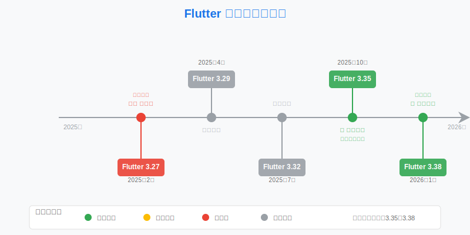
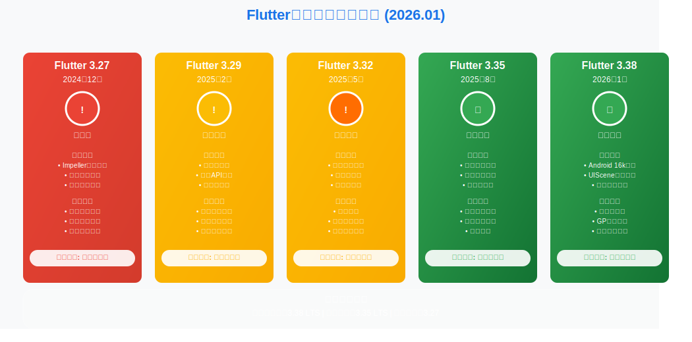
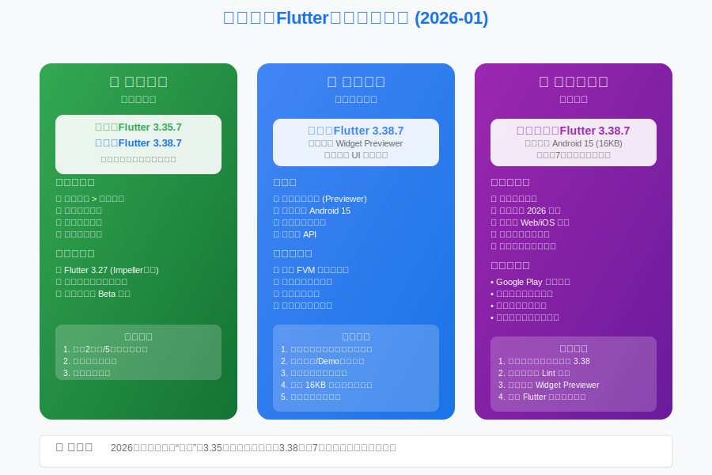

# Flutter版本选择指南：3.38.7 发布，2026新年新气象 | 2026年1月

**哈喽，我是老刘**

新年好！2026年的第一个月，Flutter 社区依旧热闹。

1月中旬，Flutter 官方悄悄发布了 **3.38.7** 稳定版。作为 3.38 系列的第7个补丁，它的出现标志着这个版本正在快速走向成熟。

新的一年，我们的版本选择策略是否需要调整？3.38 到底能不能全面接管生产环境了？

老刘带你看看2026年1月的版本选择策略。

---

## 一、1月Flutter大事件

### Flutter 3.38 2个补丁版本
在跨入2026年后，Flutter 团队没有停下脚步。
1月9日，3.38.6 正式推送。
1月15日，3.38.7 正式推送。

**以下是更新内容整理：**
### Flutter 3.38.7
该版本主要修复了一个在多设备环境下运行时的崩溃问题：

- 多设备运行崩溃修复 ：修复了当存在多个可用设备时，运行 flutter run -d all 会导致崩溃的问题 ( flutter/179857 )。
### Flutter 3.38.6
该版本包含多项针对 Android、iOS、Windows 和工具链的修复：

- Android 平台
  
  - AGP 9.0 兼容性 ：针对升级到 Android Gradle Plugin (AGP) 9.0.0 的应用，提示需要进行迁移步骤 ( flutter/179914 )。
  - 虚拟键盘显示修复 (Web) ：修复了在 Android Web 上关闭虚拟键盘后，键盘背后的区域保持空白且应用仅在原键盘上方区域绘制的问题 ( flutter/175074 )。
  - 无障碍功能崩溃修复 ：修复了在启用无障碍功能、隐藏平台视图并拉出顶部通知栏时导致应用崩溃的问题 ( flutter/180381 )。
- iOS 平台
  
  - WebView 点击失效修复 ：修复了在 iOS 26 上滚动 WebView 后，导致其无法被点击的问题 ( flutter/175099 )。
- Windows 平台
  
  - 非 ASCII 路径崩溃修复 ：修复了当运行路径包含非 ASCII 字符（如中文路径）时，应用启动崩溃的问题 ( flutter/178896 )。
- 工具与构建
  
  - Widget Preview 磁盘占用修复 ：修复了 flutter widget-preview start 命令每次运行时都会创建新的缓存构建产物，导致磁盘占用不断增加的问题 ( flutter/179139 )。
  - CI 配置更新 ：针对 Flutter CI 环境，更新了在 macOS 15 或 15.7.2 上运行测试的配置 ( flutter/176943 )。

---

## 二、Flutter最近5个版本深度解析（1月更新）

### 1. 版本列表

| Flutter 版本 | 发布日期 | Dart 版本 | 说明 |
| :--- | :--- | :--- | :--- |
| **3.38.7** | 2026年1月15日 | Dart 3.10.7 | 最新稳定版 |
| **3.35.7** | 2025年10月23日 | Dart 3.9.2 | 推荐生产版 |
| **3.32.8** | 2025年7月26日 | Dart 3.8.1 | 历史版本 |
| **3.29.3** | 2025年4月15日 | Dart 3.7.2 | 历史版本 |
| **3.27.4** | 2025年2月6日 | Dart 3.6.2 | 大坑版本 |

### 2. 核心版本分析

**Flutter 3.38.7 - 逐渐成为主力**

经过了两个月、7个补丁版本的打磨，3.38 已经褪去了刚发布时的青涩。

- **状态**：从“观察期”转为 **“推荐尝试”**。
- **Android 适配**：默认集成 NDK r28，完美支持 Android 15 的 16KB 页面大小强制要求。如果你的应用要上架 Google Play，3.38 是必须要迈过的门槛。
- **iOS 适配**：`UIScene` 的生命周期问题已经有了成熟的解决方案和文档指引。
- **评价**：除了部分老旧插件可能还没适配外，核心生态已经跟上。

**Flutter 3.35.7 - 最后的守望者**

- **状态**：**保守派首选**。
- **评价**：经过时间检验，极其稳定。但随着 2026 年 Google Play 新政合规延长截止日期的临近，留给 3.35 的时间其实不多了。建议利用这段时间开始规划向 3.38 的迁移。

如果因为其它原因需要继续使用 3.35.7，需要手工配置 16k 页面的支持。

---

## 三、1月版本选择建议

#### **生产环境（Stable Production）**

- **推荐方案 A（求稳）**：继续使用 **Flutter 3.35.7**。
  - 适合：没有 Google Play 上架压力，且当前业务运行良好的项目。
- **推荐方案 B（进取）**：升级至 **Flutter 3.38.7**。
  - 适合：需要适配 Android 15 新特性，或者希望能用上最新 Widget Previewer 提高开发效率的团队。
  - **注意**：升级前请务必在分支上进行完整的回归测试，特别是 iOS 的启动流程和 Android 的原生交互部分。

#### **开发环境（Development）**

- **推荐**：**Flutter 3.38.7**
- **理由**：开发工具链的体验在 3.38 版本有质的飞跃。新的预览器能让你少写很多热重载代码。
- **策略**：FVM 是好东西。建议本地使用 FVM 管理版本，新项目直接切到 3.38.7，老项目维护时切回 3.35.7。
老刘过去文章里也介绍过在项目中指定Flutter SDK路径，来实现多Flutter版本共存的方法。

#### **新项目启动（New Project）**

- **强烈推荐**：**Flutter 3.38.7**
- **理由**：2026年的新项目，没有任何理由再回头去用 2025 年中期的版本。直接拥抱 16KB Page Size 和 UIScene，为未来一年的维护省下麻烦。

---

## 四、技术预警：Android 16KB Page Size

虽然我们在上个月提过，但这里要再次强调。

从 Android 15 开始，Google 强制要求应用支持 16KB 内存页大小。
- **Flutter 3.38+**：通过升级 NDK 到 r28 默认支持。
- **Flutter 3.35及以下**：需要手动折腾配置，复杂度较高。

如果你的应用主要面向海外市场（Google Play），请务必把“升级到 3.38”列入 Q1 的 OKR 中。

---

## 总结

1月的关键词是 **“交接”**。

- **3.35** 正在完成它的历史使命，站好最后一班岗。
- **3.38** 经过7轮修补，已经做好了接棒的准备。

老刘建议：**趁着年初业务需求可能还没铺满，抽出时间把 Flutter 版本升了，给2026年开个好头。**

> 如果看到这里的同学对客户端开发或者Flutter开发感兴趣，欢迎联系老刘，我们互相学习。
> 
> 点击免费领老刘整理的《Flutter开发手册》，覆盖90%应用开发场景。
> 
> [覆盖90%开发场景的《Flutter开发手册》](https://mp.weixin.qq.com/s?__biz=MzkxMDMzNTM0Mw==&mid=2247483665&idx=1&sn=56aec9504da3ffad5797e703c12c51f6&chksm=c12c4d11f65bc40767956e534bd4b6fa71cbc2b8f8980294b6db7582672809c966e13cbbed25#rd)
