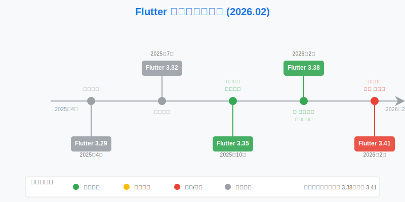
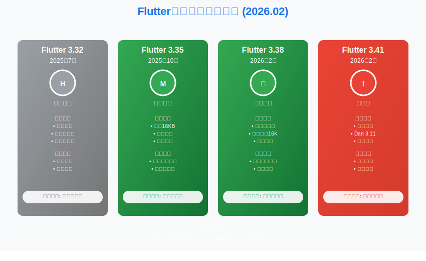
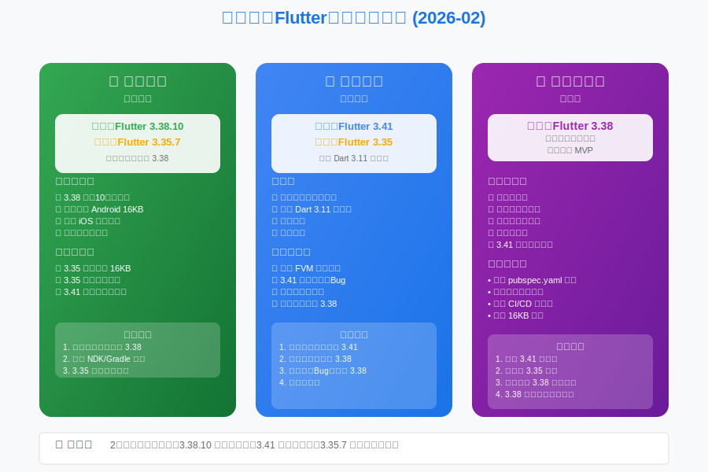

# Flutter版本选择指南：3.41 发布，性能再进化 | 2026年2月

**哈喽，我是老刘**

2月，还没过年，Flutter 团队就给大家准备好了开工大礼—— **Flutter 3.41** 正式发布。

与此同时，3.38 版本也迎来了它的第 10 个补丁版本。

一边是新的功能特性，一边是成熟的稳定性，这让不少同学又开始纠结：**开工新项目，到底选哪个？**

接下来老刘带你看看2026年2月的版本选择策略。

---

## 一、2月Flutter大事件

### Flutter 3.41 正式发布
2月12日，Flutter 3.41.0 正式版发布。

紧接着在短短一周内，官方又连续推送了两个补丁版本。

这种高频的初期修复，基本属于Flutter的常规操作了。

### Flutter 3.38 持续打磨
作为上个季度的核心版本，3.38 在 2 月份依然保持更新。

2月12日，3.38.10 发布。

作为一个拥有 10 个补丁版本的系列，3.38 已经熟透了，是目前生产环境稳健的选择。

**以下是更新内容整理：**

### Flutter 3.41.2 (最新)
- **Android 渲染修复**：修复了在未启用内容大小时，Android 平台视图可能因竞争条件导致渲染不正确的问题 (flutter/179673)。

- **Web 构建修复**：修复了 `flutter build web` 忽略 `--web-define` 标志的问题 (flutter/182076)。

- **Web 渲染修复**：修复了多表面渲染器 (multisurfacerenderer) 中 Canvas 缺少绝对定位样式的问题 (flutter/182292)。

### Flutter 3.38.10
- **稳定性增强**：主要集中在底层引擎的稳定性修复，确保在 Android 15 和 iOS 18 上的表现如丝般顺滑。

---

## 二、Flutter最近5个版本深度解析（2月更新）

### 1. 版本列表

| Flutter 版本 | 发布日期 | Dart 版本 | 说明 |
| :--- | :--- | :--- | :--- |
| **3.41.2** | 2026年2月20日 | Dart 3.11.0 | **最新发布** |
| **3.38.10** | 2026年2月12日 | Dart 3.10.9 | **黄金稳定版** |
| **3.35.7** | 2025年10月23日 | Dart 3.9.2 | 养老版本 |
| **3.32.8** | 2025年7月26日 | Dart 3.8.1 | 历史版本 |
| **3.29.3** | 2025年4月15日 | Dart 3.7.2 | 历史版本 |

### 2. 核心版本分析

**Flutter 3.41.2 - 新玩具**

- **状态**：**观察期**。

- **评价**：虽然带来了 Dart 3.11 ，但发布一周内连发两个补丁，说明还存在一些磨合问题。

- **建议**：适合个人项目尝鲜，或者作为技术储备进行调研。

    生产环境建议再等一等，按照我们的一贯策略观察两个月再考虑生产环境。

**Flutter 3.38.10 - 中流砥柱**

- **状态**：**强烈推荐**。

- **评价**：经过10轮修补，3.38 已经达到了稳定性的巅峰。

- **优势**：
  - 完美支持 Android 15 (16KB Page Size)。

  - 解决了 iOS 启动和生命周期的痛点。

  - 生态兼容性极好，主流插件均已适配。

**Flutter 3.35.7 - 老当益壮**

- **状态**：**维护模式**。

- **评价**：如果你的项目依赖的三方库还没有适配新的Flutter版本，确实可以继续使用3.35。

    但是也是时候把升级提上日程了。

    随着 Google Play 新政的推进，3.35 在新系统适配上的成本会越来越高（需要手工配置 Android 16k 页面的支持）。

---

## 三、2月版本选择建议

#### **生产环境（Stable Production）**

- **首选方案**：**Flutter 3.38.10**

  - **理由**：没有比一个修了10次的版本更让人放心的了。

  - 它既有新特性（支持 16KB Page Size），又有经过验证的稳定性。

  - **适合**：绝大多数商业项目，无论是维护还是新发版。

- **保守方案**：继续使用 **Flutter 3.35.7**

  - **理由**：仅限于历史包袱极重、且近期没有发版计划的项目。

  - **警告**：不要在 3.35 上停留太久，技术债务是有利息的。

#### **开发环境（Development）**

- **推荐**：**Flutter 3.41.2**

  - **理由**：对于开发者来说，提前适应 Dart 3.11 的语法糖和工具链改进是有益的。

  - **策略**：要综合考虑项目依赖的三方库的适配情况，如果还没有适配建议暂缓考虑升级。

#### **新项目启动（New Project）**

- **推荐**：**Flutter 3.38.10**

  - **理由**：虽然 3.41 出来了，但新项目启动初期需要的是不折腾。

    特别是新项目需要引入大量的三方库。
    生态还不完善的情况下，对项目的推进会形成压力。
    3.38 的生态最完善，遇到的坑最少，能让你快速跑通 MVP。

---

## 四、技术预警：Android 16KB Page Size

这个问题老刘已经念叨了三个月了，但依然重要。

- **现状**：Google Play 已经开始对不支持 16KB Page Size 的应用进行警告。

- **检查**：使用 Flutter 3.38+ 构建的应用默认支持。

- **行动**：如果你还在用老版本，且不想升级 Flutter，你需要手动修改 Gradle 配置和 NDK 版本，过程还是蛮痛苦的。

- **如果不想折腾，升 3.38 吧。**

---

## 总结

2月的关键词是 **“稳中求进”**。

- **3.38.10** 是当下的绝对主力，选它准没错。

- **3.41.2** 是未来的方向，保持关注，适度尝鲜。

老刘建议：**新的一年，用最稳的版本（3.38.10）打好地基，同时用最新的版本（3.41.2）开拓视野。**

> 如果看到这里的同学对客户端开发或者Flutter开发感兴趣，欢迎联系老刘，我们互相学习。
> 
> 点击免费领老刘整理的《Flutter开发手册》，覆盖90%应用开发场景。
> 
> [覆盖90%开发场景的《Flutter开发手册》](https://mp.weixin.qq.com/s?__biz=MzkxMDMzNTM0Mw==&mid=2247483665&idx=1&sn=56aec9504da3ffad5797e703c12c51f6&chksm=c12c4d11f65bc40767956e534bd4b6fa71cbc2b8f8980294b6db7582672809c966e13cbbed25#rd)
