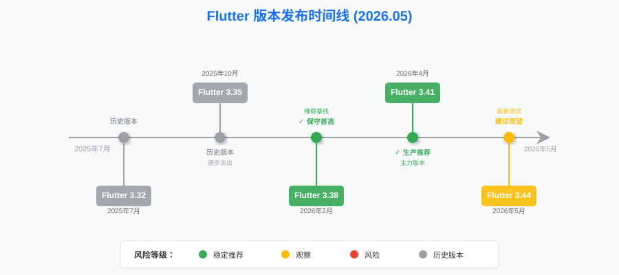
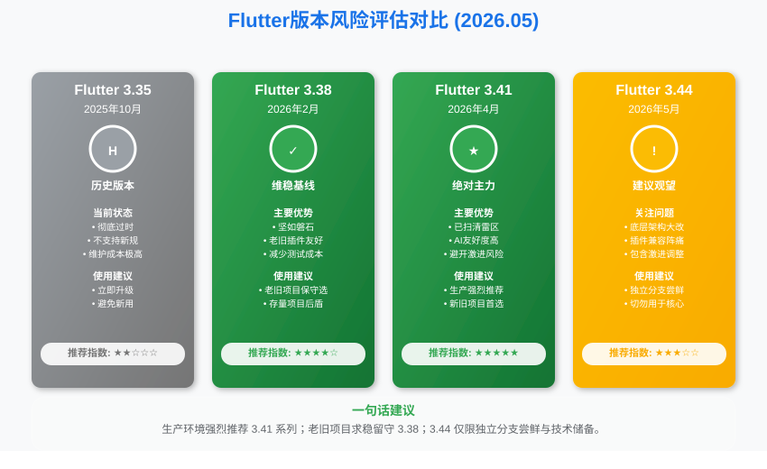
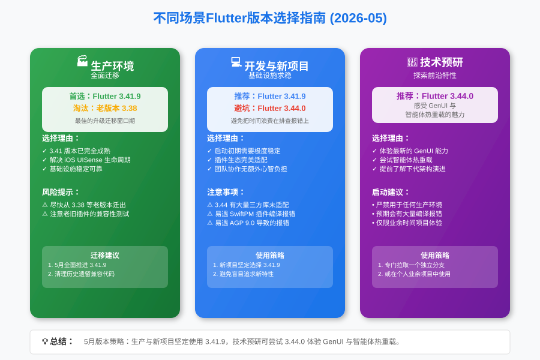

**大家好，我是老刘**

5月最激动人心的事情莫过于Google I/O 2026大会上Flutter 3.44的正式发布。这个版本带来了诸如Agentic Hot Reload、Android Hybrid Composition++以及SwiftPM作为iOS默认包管理器等重磅更新。

有些同学已经迫不及待的问老刘能否直接升级Flutter 3.44了。

但熟悉老刘的朋友都知道，我的Flutter版本选择策略一直是：**新发布的大版本先观望两个月，然后再考虑升级**。因此，尽管3.44非常诱人，但本月我们在生产环境的重心依然是已经迭代到第9个补丁的3.41系列。

***

## 一、5月Flutter大事件

### Flutter 3.44震撼发布

5月19日，Flutter 3.44（伴随Dart 3.12）在Google I/O大会上正式亮相。这是一次包含不少破坏性升级的更新，核心亮点包括：

- **AI开发者体验重塑**
推出了Agentic Hot Reload（智能体热重载），AI助手修改代码后可自动触发热重载；引入LiteRT-LM支持设备端AI大模型（如Gemma 4）。
- **iOS构建系统大换血**
Swift Package Manager (SwiftPM)正式取代CocoaPods成为iOS和macOS的默认配置。
- **Android渲染突破**
引入了Hybrid Composition++ (HCPP)，直接利用Vulkan交换链大幅提升Platform Views的渲染性能。
- **架构解耦开启**
Material和Cupertino库正式冻结，未来将作为独立的第三方Package进行维护。

如果想看更详细的3.44更新内容，可以回顾老刘之前翻译的官方博客

[Flutter 3.44 有哪些变化？（官方blog完整翻译）](https://mp.weixin.qq.com/s/CqhWF2V27FaMDJtfFonoWQ)

### Flutter 3.41系列持续打磨

5月1日，官方发布了3.41.9补丁。历经9个小版本的迭代，3.41系列已经将初期的各种边缘问题修复完毕，稳定性达到了极高的水准。

***

## 二、Flutter最近5个版本深度解析（5月更新）

老规矩，我们先看当前核心大版本的状态全景：

### 1. 版本列表

为了更直观展示各版本的发布时间线和生命周期，先来看一张核心版本演进图：

| Flutter大版本 | 最近补丁发布日期 | Dart主版本 | 说明 |
| :--- | :--- | :--- | :--- |
| **3.44** | 2026年5月19日（3.44.0） | Dart 3.12.0 | **最新大版本，建议观望测试** |
| **3.41** | 2026年5月1日（3.41.9） | Dart 3.11.5 | **当前推荐的生产环境主力版本** |
| **3.38** | 2026年2月12日（3.38.10） | Dart 3.10.9 | 保守派的维稳基线 |
| **3.35** | 2025年10月23日（3.35.7） | Dart 3.9.2 | 逐步淡出的旧版本 |
| **3.32** | 2025年7月26日（3.32.8） | Dart 3.8.1 | 历史版本 |

### 2. 核心版本分析

**Flutter 3.44.0 - 尝鲜与技术储备**

- **状态**
**非生产环境使用，建议观望。**
- **评价**
包含大量底层架构变动（如SwiftPM默认化、Material解耦准备、Android AGP 9.0兼容）。这些改动极易引发第三方插件的兼容性阵痛。
- **策略**
可以在独立分支或个人学习项目中尝鲜Agentic Hot Reload等AI开发流，但切勿在核心商业项目中直接升级。

**Flutter 3.41.9 - 绝对主力**

- **状态**
**强烈推荐生产环境升级。**
- **评价**
经过了整整3个月、9个补丁的洗礼，3.41系列已经扫清了雷区。
- **优势**
既享有Dart 3.11带来的性能和AI编码亲和力，又避开了3.44激进架构调整带来的风险。

**Flutter 3.38.10 - 维稳基线**

- **状态**
**老旧项目保守选择。**
- **评价**
如果你的项目极度依赖一些久未更新的第三方插件，或者没有充足的测试资源，3.38.10依然是坚如磐石的后盾。

***

## 三、5月版本选择建议

#### **生产环境（Stable Production）**

- **推荐**
**Flutter 3.41.9**
- **理由**
3.41已经完全成熟。现在正是从3.38等老版本向3.41迁移的最佳窗口期。同时也解决了iOS端UISense生命周期的问题。

#### **开发环境与新项目（Development & New Project）**

- **推荐**
**Flutter 3.41.9**
- **理由**
新项目同样推荐使用3.41.9。虽然3.44有诸多新特性，但新项目启动初期需要极其稳定的基础设施，避免把时间浪费在排查SwiftPM或AGP 9.0导致的插件编译报错上，同时3.44必定有很多三方库和插件没有适配，对新项目是巨大的挑战。

#### **技术预研（Tech Exploration）**

- **推荐**
**Flutter 3.44.0**
- **理由**
专门拉一个分支，或者在你的业余时间项目里，去感受一下GenUI和智能体热重载的魅力吧。

***

## 四、技术关注点：AI工具链与架构大解耦

本月有两个趋势值得所有客户端开发者高度关注：

1. **AI工具链从辅助走向主导**
3.44引入的Agentic Hot Reload意味着AI模型可以直接与Flutter运行环境交互。我们不再是单纯地复制粘贴AI生成的代码，而是转变为架构和协调多个智能体。掌握Cursor、Antigravity或OpenCode等AI IDE的使用，将成为下半年的核心竞争力。
2. **包管理和构建系统的洗牌**
iOS端告别CocoaPods转向SwiftPM，Android端强制适配AGP 9.0与内置Kotlin。接下来的两个月，Flutter插件生态将迎来一次大范围的阵痛期和洗牌期。这也是老刘坚持让大家把3.44观望两个月的最根本原因——让子弹先飞一会儿，让插件作者们先把坑踩完。

***

## 总结

5月是属于Flutter 3.44的狂欢月，但对于真正的商业工程而言，**稳定压倒一切**。

老刘建议：**面对3.44的诱惑保持克制，坚持大版本发布后观望两个月的原则。利用5月和6月的时间，将生产环境全面夯实到3.41.9版本上。**

> 🤝 如果看到这里的同学对客户端开发或者Flutter开发感兴趣，欢迎联系老刘，我们互相学习。
>
> 🎁 点击免费领老刘整理的《Flutter开发手册》，覆盖90%应用开发场景。
>
> 🚀 [覆盖90%开发场景的《Flutter开发手册》](https://mp.weixin.qq.com/s/6FeO9IoHbEuM-vhISitUxw)
    

> 📂 老刘也把自己历史文章整理在GitHub仓库里，方便大家查阅。
> 
> 🔗 <https://github.com/lzt-code/blog>