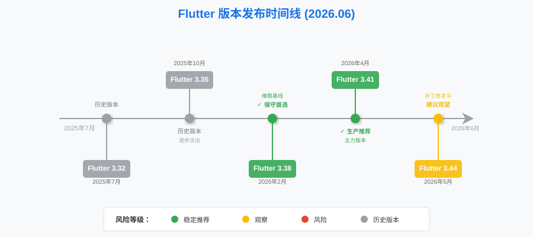
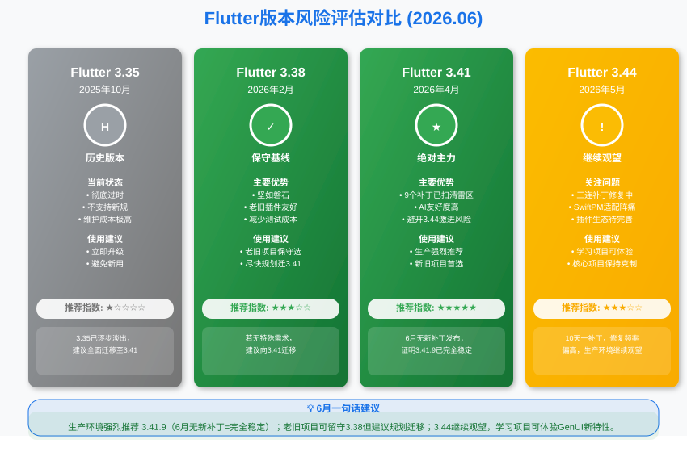
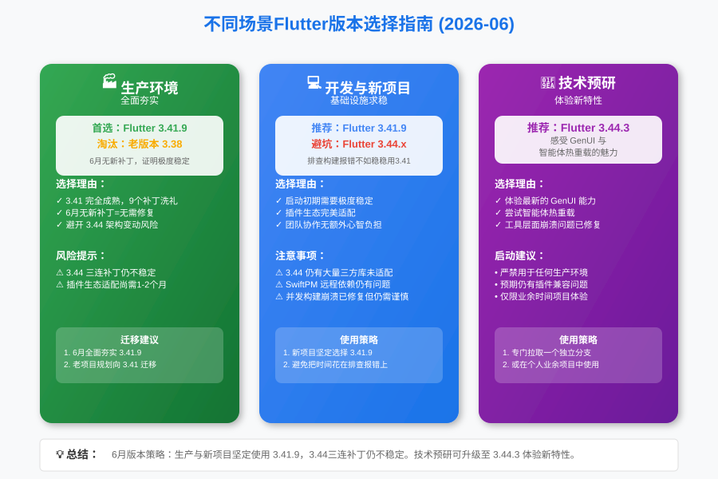

**大家好，我是老刘**

每次Flutter发新版本，群里总有人问："老刘，3.44.3出来了，我能升了吗？"

我的回答永远不变：**再等等。**

不是我不信任Google的修复速度。事实上，3.44系列这一个月发三个补丁，节奏还算克制。但是，**补丁版本的稳定不等于生产环境的可靠**，尤其是3.44这一版动了SwiftPM和Android底层架构，第三方插件的适配进度至今没有一个明确的说法。

今天这篇，我把6月所有版本状态、修复内容和选择策略一次性讲清楚，帮你做出不后悔的决定。

***

## 一、6月Flutter大事件

### Flutter 3.44系列三连补丁

自5月19日Google发布3.44.0以来，一个月时间官方发布了三个补丁版本：

- **3.44.1（6月2日）**
修复了分析服务器意外退出和Chrome连接失败导致的工具崩溃问题。
- **3.44.2（6月12日）**
重点修复了SwiftPM远程依赖下载失败、Android edge-to-edge模式系统栏不可见等问题。
- **3.44.3（6月23日）**
修复了并发构建崩溃、动画PNG渲染崩溃等严重问题。

大约每10天发布一个修复版本，这种修复频率在Flutter历史版本中并不算特别高频次的补丁节奏。

### Flutter 3.41系列稳定收官

6月没有新的3.41补丁发布，但这恰恰是好消息，说明3.41.9已经是一个无需额外修复的稳定版本。

***

## 二、Flutter最近5个版本深度解析（6月更新）

老规矩，我们先看当前核心大版本的状态全景：

### 1. 版本列表

为了更直观展示各版本的发布时间线和生命周期，先来看一张核心版本演进图：

| Flutter大版本 | 最近补丁发布日期 | Dart主版本 | 说明 |
| :--- | :--- | :--- | :--- |
| **3.44** | 2026年6月23日（3.44.3） | Dart 3.12.2 | **连续三个补丁修复中，仍不建议生产使用** |
| **3.41** | 2026年5月1日（3.41.9） | Dart 3.11.5 | **当前推荐的生产环境主力版本** |
| **3.38** | 2026年2月12日（3.38.10） | Dart 3.10.9 | 保守派的维稳基线 |
| **3.35** | 2025年10月23日（3.35.7） | Dart 3.9.2 | 逐步淡出的旧版本 |
| **3.32** | 2025年7月26日（3.32.8） | Dart 3.8.1 | 历史版本 |

### 2. 核心版本分析

**Flutter 3.44.3 - 仍在修复期，暂不推荐**

- **状态**
**非生产环境使用，继续观望。**

- **评价**
稳定的每隔10天发布一个补丁版本，一方面说明并没有碰到严重到需要紧急修复的bug。

另一方面仔细去看change log会发现，仍然会修复一些渲染、构建crash等比较严重的bug。

3.44引入的SwiftPM默认化、Android Hybrid Composition++等底层改动，正在通过补丁逐步修复。但第三方插件的适配进度仍然不明朗。

- **策略**
可以继续在学习项目中体验Agentic Hot Reload等新特性，但核心商业项目请继续保持克制。

**Flutter 3.41.9 - 绝对主力，放心升级**

- **状态**
**强烈推荐生产环境使用。**

- **评价**
经过3个月、9个补丁的洗礼，3.41系列已经是一个无需额外修复的稳定版本。

- **优势**
既享有Dart 3.11带来的性能和AI编码亲和力，又完全避开了3.44激进架构调整带来的风险。

**Flutter 3.38.10 - 老旧项目保守选择**

- **状态**
**老旧项目保守选择。**

- **评价**
如果你的项目极度依赖一些久未更新的第三方插件，或者没有充足的测试资源，3.38.10依然是坚如磐石的后盾。但老刘建议尽快规划向3.41迁移。

***

## 三、6月版本选择建议

#### **生产环境（Stable Production）**

- **推荐**
**Flutter 3.41.9**

- **理由**
3.41已经完全成熟，6月没有新的3.41补丁发布恰恰证明了其稳定性。如果你还在使用3.38或更早版本，现在正是向3.41迁移的最佳窗口期。

#### **开发环境与新项目（Development & New Project）**

- **推荐**
**Flutter 3.41.9**

- **理由**
新项目同样推荐使用3.41.9。3.44虽然补丁的频率并不高，但是修复了很多严重问题，包括构建中的崩溃以及图片渲染的崩溃。把时间花在排查构建报错上，不如稳稳地用3.41。

#### **技术预研（Tech Exploration）**

- **推荐**
**Flutter 3.44.3**

- **理由**
专门拉一个分支，或者在你的业余时间项目里，去感受一下GenUI和智能体热重载的魅力吧。3.44.3已经修复了大部分工具层面的崩溃问题，体验比3.44.0好很多。

***

## 四、技术关注点：SwiftPM阵痛期与插件生态洗牌

本月最值得关注的趋势有两个：

### 1. SwiftPM默认化引发的连锁反应

3.44将Swift Package Manager正式设为iOS/macOS默认包管理器，这本是Google跟进业界趋势的正确决策。但现实是残酷的：

- 远程Swift包依赖下载失败（3.44.2修复）
- 非Apple平台构建出现误报警告（3.44.2修复）
- 并发构建时目录/文件/符号链接创建冲突导致崩溃（3.44.3修复）

这些问题说明**SwiftPM的迁移之路远比预期复杂**。Flutter插件生态需要时间来全面适配，而这个周期至少还需要1-2个月。

### 2. AI工具链从辅助走向主导

3.44引入的Agentic Hot Reload意味着AI模型可以直接与Flutter运行环境交互。我们不再是单纯地复制粘贴AI生成的代码，而是转变为架构和协调多个智能体。

掌握Cursor、Claude Code或OpenCode等AI IDE的使用，已经成为下半年的核心竞争力。

***

## 总结

6月的Flutter社区，3.44系列的补丁既是官方对问题的积极回应，也是老刘坚持观望策略的有力佐证。

老刘建议：**面对3.44的诱惑继续保持克制，坚持大版本发布后观望两个月的原则。利用6月的时间，将生产环境全面夯实到3.41.9版本上。**

> 🤝 如果看到这里的同学对客户端开发或者Flutter开发感兴趣，欢迎联系老刘，我们互相学习。
>
> 🎁 点击免费领老刘整理的《Flutter开发手册》，覆盖90%应用开发场景。
>
> 🚀 [覆盖90%开发场景的《Flutter开发手册》](https://mp.weixin.qq.com/s/6FeO9IoHbEuM-vhISitUxw)

> 📂 老刘也把自己历史文章整理在GitHub仓库里，方便大家查阅。
> 
> 🔗 <https://github.com/lzt-code/blog>

