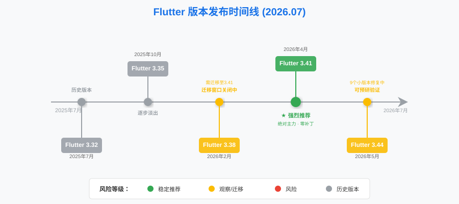
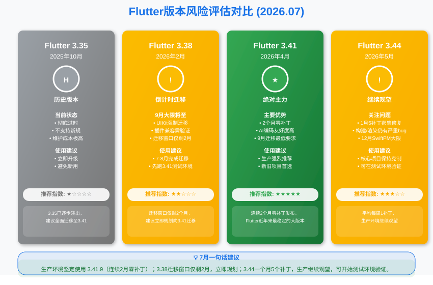
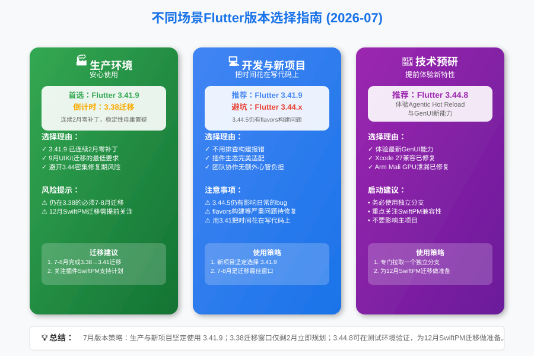

**大家好，我是老刘**

7月了，离9月UIKit强制迁移只剩不到两个月。

群里开始有人慌了："老刘，9月就要强制升3.41了，我还在3.38上怎么办？"

别急，我们先把7月的版本情况捋清楚，然后再说迁移的事。

***

## 一、7月Flutter大事件

### Flutter 3.44系列五连补丁

从6月25日的3.44.4到7月24日的3.44.8，一个月时间官方发布了5个补丁版本：

- **3.44.4（6月25日）**
修复了Linux平台FlAccessibleTextField的边界检查问题。
- **3.44.5（7月7日）**
重点修复了Android应用使用flavors构建时libapp.so缺失、文字阴影渲染错位、以及Impeller/Vulkan在部分Android设备上的崩溃问题。
- **3.44.6（7月10日）**
修复了Linux平台启用native assets时构建崩溃，以及Android instrumented测试崩溃。
- **3.44.7（7月21日）**
修复了使用外部纹理时因资源泄漏导致的崩溃问题，主要影响Arm Mali GPU设备。
- **3.44.8（7月24日）**
修复了Xcode 27工具链构建失败，以及部分厂商修改的Android 11 ROM上无障碍桥接字段解析失败的问题。

**5个补丁，平均每周一个。** 修复的不再是小打小闹的工具崩溃，而是Android构建失败、渲染错位、GPU资源泄漏这些会直接影响用户看到的bug。

### Flutter 3.41系列继续隐身

6月、7月连续两个月没有新的3.41补丁发布。3.41.9依然是该系列的最终版本，发布于5月1日。

这种"隐身"恰恰是最好的消息，**一个不需要补丁的版本，才是最稳定的版本。**

***

## 二、Flutter最近5个版本深度解析（7月更新）

### 1. 版本列表

为了更直观展示各版本的发布时间线和生命周期，先来看一张核心版本演进图：

| Flutter大版本 | 最近补丁发布日期 | Dart主版本 | 说明 |
| :--- | :--- | :--- | :--- |
| **3.44** | 2026年7月24日（3.44.8） | Dart 3.12.2 | **密集修复中，仍在快速迭代** |
| **3.41** | 2026年5月1日（3.41.9） | Dart 3.11.5 | **当前推荐的生产环境主力版本** |
| **3.38** | 2026年2月12日（3.38.10） | Dart 3.10.9 | 保守派的维稳基线 |
| **3.35** | 2025年10月23日（3.35.7） | Dart 3.9.2 | 逐步淡出的旧版本 |
| **3.32** | 2025年7月26日（3.32.8） | Dart 3.8.1 | 历史版本 |

### 2. 核心版本分析

**Flutter 3.44.8 - 仍在密集修复期，但需开始关注**

- **状态**
**非生产环境使用，继续观望，但需开始为迁移做准备。**

- **评价**
一个月5个补丁，修复的问题从工具层面上升到了渲染和构建层面。3.44.5修复的flavors构建导致libapp.so缺失、文字阴影渲染错位，这些问题如果出现在生产环境里，后果不堪设想。

老刘记得3.44刚发布不到一个月就有朋友急着迁移过去了，现在就想问问，你的代码上线了吗？有没有碰到这些问题？如果让你重新选，你还会那么早迁移吗？

但换个角度看，Google的修复力度在加大。3.44.7修复的Arm Mali GPU资源泄漏、3.44.8修复的Xcode 27构建失败，说明团队在认真对待各平台的兼容性问题。

- **策略**
核心商业项目继续保持克制。但如果你的项目计划在年底前升级到3.44，现在可以在测试环境中开始验证了。重点关注SwiftPM迁移和Android构建的兼容性。

**Flutter 3.41.9 - 绝对主力，安心使用**

- **状态**
**强烈推荐生产环境使用。**

- **评价**
5月1日发布至今已超过两个月，零补丁，零问题报告。3.41.9是Flutter近年来最安静、最稳定的大版本。

- **优势**
既享有Dart 3.11带来的性能和AI编码亲和力，又完全避开了3.44激进架构调整带来的风险。9月UIKit强制迁移即将到来，3.41是最低要求——现在升级3.41，正好赶上这个节点。

**Flutter 3.38.10 - 倒计时开始**

- **状态**
**老旧项目保守选择，但迁移窗口正在关闭。**

- **评价**
3.38.10依然稳定，但9月的UIKit强制迁移意味着仍在使用3.38的项目将面临升级压力。如果你的项目极度依赖久未更新的第三方插件，现在是时候联系插件维护者确认适配计划了。

***

## 三、7月版本选择建议

#### **生产环境（Stable Production）**

- **推荐**
**Flutter 3.41.9**

- **理由**
3.41.9已经连续两个月零补丁发布，稳定性毋庸置疑。对于大多数团队来说，现在升级到3.41是最佳时机——既能在9月UIKit强制迁移前完成适配，又能避开3.44的密集修复期。

#### **开发环境与新项目（Development & New Project）**

- **推荐**
**Flutter 3.41.9**

- **理由**
新项目同样推荐3.41.9。3.44.5修复的flavors构建问题说明该系列仍有影响日常开发的严重bug未被发现。用3.41，把时间花在写代码上，而不是排查构建报错。

#### **技术预研（Tech Exploration）**

- **推荐**
**Flutter 3.44.8**

- **理由**
3.44.8已经修复了大量严重问题，包括Xcode 27兼容性、Arm Mali GPU资源泄漏等。如果你想提前体验Agentic Hot Reload和GenUI，现在是比6月更好的时机。但请务必使用独立分支，不要影响主项目。

***

## 四、技术关注点：9月大限与迁移准备

本月最值得关注的不再是3.44的bug修复，而是即将到来的两个强制迁移时间节点：

### 1. 9月UIKit强制迁移

Flutter将在9月强制要求iOS应用使用UIKit（而非旧的UIScreen方式）。

- **最低要求：Flutter 3.41**
- 仍在使用3.38或更早版本的项目，必须在9月前完成迁移
- 迁移本身并不复杂，但是第三方插件的兼容性需要提前验证

**建议**：如果你还在3.38上，7-8月就是你的迁移窗口。先在测试环境跑一遍3.41.9，确认所有插件正常工作，再安排正式升级。

### 2. 12月SwiftPM强制迁移

Flutter将在12月强制使用Swift Package Manager替代CocoaPods。

- **最低要求：Flutter 3.44**
- 所有iOS/macOS项目都需要迁移
- 第三方插件必须支持SwiftPM

**建议**：从现在开始关注你使用的插件是否有SwiftPM支持的计划。对于核心依赖，可以开始在3.44.8上做兼容性测试。

### 3. AI工具链的持续进化

3.44引入的Agentic Hot Reload和GenUI概念正在逐步落地。有效利用AI工具链，已经是当下Flutter开发的核心能力。

老刘观察到的趋势是：**能熟练使用AI工具的开发者，产出效率是不用AI的3-5倍。** 这个差距在下半年会进一步拉大。

***

## 总结

7月的Flutter社区，3.44系列的密集补丁说明它仍在快速成熟，从时间上看，3.44发布已经两个月了，从历史大版本看，9个小版本也接近大版本的稳定边界了。

老刘建议：**生产环境继续坚持3.41.9，但如果你的项目还在3.38或更早版本，7-8月是向3.41迁移的最佳窗口。对于12月的SwiftPM强制迁移，现在就开始关注插件兼容性，不要等到11月才手忙脚乱。**

> 🤝 如果看到这里的同学对客户端开发或者Flutter开发感兴趣，欢迎联系老刘，我们互相学习。
>
> 🎁 点击免费领老刘整理的《Flutter开发手册》，覆盖90%应用开发场景。
>
> 🚀 [覆盖90%开发场景的《Flutter开发手册》](https://mp.weixin.qq.com/s/6FeO9IoHbEuM-vhISitUxw)

> 📂 老刘也把自己历史文章整理在GitHub仓库里，方便大家查阅。
> 
> 🔗 <https://github.com/lzt-code/blog>
