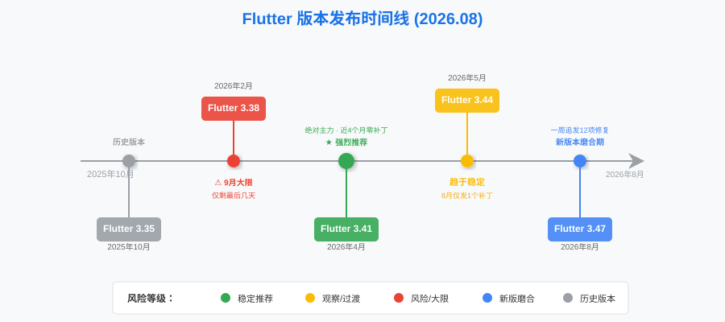
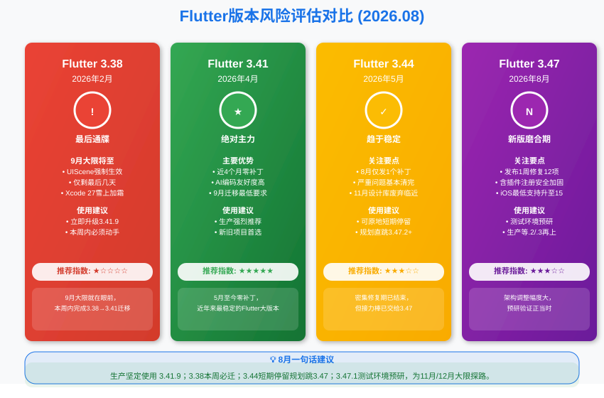
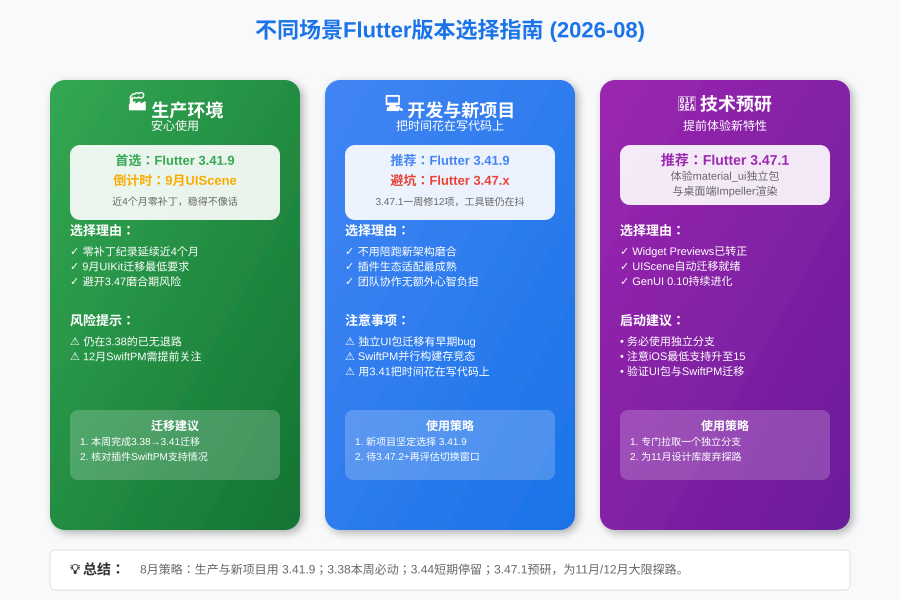

**大家好，我是老刘**

8月底了，离9月UIKit强制迁移，满打满算只剩一个星期。

上个月我说"7-8月是迁移窗口"，群里还有同学回我："不急，9月再说吧。"兄弟，你现在可还不着急？

好在8月的动静不小：Flutter 3.47赶在大限前压哨发布，还捎上了Dart 3.13。照例，我们先把8月的版本情况捋清楚，再说接下来该干什么。

***

## 一、8月Flutter大事件

### Flutter 3.47压哨发布

8月13日，Flutter 3.47正式上线，距离9月大限不到三周。这次随行的还有Dart 3.13。

老刘觉得重点有三个：

**1. Material和Cupertino拆出核心SDK**

`material_ui`和`cupertino_ui`两个独立包正式1.0上架pub.dev，从此可以按自己的周节奏迭代，不用陪着整个SDK季度更新。官方提供了迁移工具：

```bash
dart fix --apply --code=migrate_design_widgets
```

注意，SDK内置的Material和Cupertino库**今年11月的秋季版就会正式标记废弃**。又一个新的倒计时挂在了墙上。

**2. 为Xcode 27和iOS 27铺路**

iOS 27 SDK强制要求UIScene生命周期，用Xcode 27构建却不采用UIScene的应用会直接启动失败。大多数应用Flutter CLI会在构建时自动完成迁移，但如果你的AppDelegate里有自定义原生代码，或者插件还挂在旧的生命周期上，就得自己动手了。

另外两个数字要记一下：iOS最低支持从13提到了15，macOS从10.15提到了12。还要支持iPhone老机型的团队，这就是你暂时不能上3.47的现实原因。

**3. Impeller全面登陆桌面端**

macOS、Windows、Linux三端的Impeller成为默认渲染引擎，桌面文本也换上了SDF渲染，清晰度提升肉眼可见。Widget Previews正式转正，GenUI也来到了0.10版本。

### 3.44系列安静下来了

对比一下节奏：7月连发5个补丁，平均一周一个；8月只发了8月7日的3.44.9一个小补丁。

**密集修复期结束，3.44终于安静了下来。** 它的接力棒已经交到了3.47手上。

### 3.47.1一周紧急跟进

更能说明问题的是3.47自己：3.47.0发布仅仅一周，8月20日就追发了3.47.1，一口气修了12个问题：

- iOS/macOS多target并行构建时，SwiftPM集成的竞态条件导致FileSystemException
- 校验插件类名与包名标识符，堵住了向GeneratedPluginRegistrant注入任意代码的口子。注意，这是安全问题
- WASM Web构建的热重启失效
- Windows下路径包含Unicode字符时shader编译器崩溃

一周12个修复，还有安全级别的。**新王已经登基，但磨合期才刚刚开始。**

***

## 二、Flutter最近5个版本深度解析（8月更新）

### 1. 版本列表

为了更直观展示各版本的发布时间线和生命周期，先来看一张核心版本演进图：



| Flutter大版本 | 最近补丁发布日期 | Dart主版本 | 说明 |
| :--- | :--- | :--- | :--- |
| **3.47** | 2026年8月20日（3.47.1） | Dart 3.13.1 | **刚发布，快速磨合中** |
| **3.44** | 2026年8月7日（3.44.9） | Dart 3.12.2 | 趋于稳定，交棒3.47 |
| **3.41** | 2026年5月1日（3.41.9） | Dart 3.11.5 | **当前推荐的生产环境主力版本** |
| **3.38** | 2026年2月12日（3.38.10） | Dart 3.10.9 | 9月大限，最后通牒 |
| **3.35** | 2025年10月23日（3.35.7） | Dart 3.9.2 | 彻底过时 |

### 2. 核心版本分析



**Flutter 3.47.1 - 新版本磨合期，预研正当时**

- **状态**
**非生产环境使用，测试环境预研。**

- **评价**
发布一周就追发12项修复，里面还有插件注册器的代码注入防护，说明3.47的架构调整幅度不小：设计系统拆包、SwiftPM深度集成，哪一件都是伤筋动骨的事。

还记得3.44刚发布那会儿抢着升级的朋友吗？这回学乖了吧，让子弹再飞一会儿。

- **策略**
想在11月设计库废弃、12月SwiftPM大限前趟平路的团队，现在可以在独立分支上预研3.47.1了。重点验证两件事：`dart fix`设计库迁移的兼容性，以及SwiftPM构建的稳定性。

**Flutter 3.44.9 - 安静收官，够格但不值得专门动一次**

- **状态**
**已具备主力资格，但老刘仍不建议为它专门升级。**

- **评价**
8月只有一个小补丁，说明3.44系列的严重问题基本清完了。还在3.44上的团队不用慌，你们手里这个版本目前是安全的。

写到这儿，肯定有同学要拍桌子：3.44发布都满3个月了，10个补丁、修复节奏归零，按7月我自己说的"大版本稳定边界"，它早该转正了，凭啥不列为生产主力？

老刘的三点考虑：

**第一，迁移次数最少原则。** 9月UIKit大限的门槛只是3.41，12月SwiftPM的门槛才是3.44。生产主力定在3.41.9，大多数团队到年底只需要动一次；要是现在全面转3.44，等3.47站稳了还得再迁一次。对生产环境来说，被迫移动的次数本身就是风险。

**第二，证据标准不一样。** 我给"绝对主力"定的门槛是"长期零补丁+生态完全消化"，而不是"补丁变少"。3.44前面5个补丁修的都是构建失败、渲染错位这个级别的问题，这类修复本身也需要一段生产验证期。8月节奏归零到现在才一个月，观察窗口还太短。

**第三，定位尴尬。** 11月内置设计库废弃、12月SwiftPM强制，风暴眼都紧挨着这一代。3.44注定是个过渡版本，不适合核心项目长住。与其在3.44上反复横跳，不如等3.47出了.2、.3之后一步到位。

话说回来，如果你已经在3.44上，留在3.44.9完全成立，没必要折腾。真正不划算的，是为了它从稳定的3.41再专门动一次。

- **策略**
保持现状，顺手把`flutter analyze`跑一遍，看看有没有独立UI包迁移的阻塞项。3.47稳定后的第一波升级名单里，应该有你；年底就要交付SwiftPM适配的项目除外，你们可以直接以3.44.9为基线，提前开始验证。

**Flutter 3.41.9 - 绝对主力，纪录还在延续**

- **状态**
**强烈推荐生产环境使用。**

- **评价**
5月1日发布至今将近4个月，零补丁纪录还在延续。放在3.44上半年那种一周一补的衬托下，这份安静显得尤其珍贵。

9月UIKit迁移的最低门槛就是它，现在上车正好。

**Flutter 3.38.10 - 最后通牒**

- **状态**
**没有任何缓冲余地了。**

- **评价**
上个月说的是"迁移窗口正在关闭"，这个月得换个说法：门关到只剩一条缝了。9月UIScene强制迁移生效，再叠加今秋的Xcode 27和iOS 27，留在3.38上的每一天都是在攒风险。

- **策略**
本周就动。先在测试环境跑通3.41.9，确认插件全部正常，再安排正式升级。真的没有"下个月"了。

***

## 三、8月版本选择建议



#### **生产环境（Stable Production）**

- **推荐**
**Flutter 3.41.9**

- **理由**
零补丁纪录即将满4个月，稳定性无可挑剔。9月UIKit强制迁移的最低要求正是3.41，而3.47还在磨合期。无论从哪个角度看，3.41.9都是此刻最稳妥的答案。（肯定有同学要问：同样稳定的3.44为啥不行？这笔账老刘在第二节算过了。）

#### **开发环境与新项目（Development & New Project）**

- **推荐**
**Flutter 3.41.9**

- **理由**
3.47.1一周修12个问题的动作说明新工具链还没磨顺。新项目要的是把时间花在写代码上，而不是陪跑新架构的磨合期。等3.47.2或者下一个季度版出来再看不迟。

#### **技术预研（Tech Exploration）**

- **推荐**
**Flutter 3.47.1**

- **理由**
想提前体验独立UI包、桌面端Impeller和转正的Widget Previews，现在是最好的时机。何况11月设计库废弃、12月SwiftPM强制这两道坎，早晚要用3.47去趟，不如现在就开始。

***

## 四、技术关注点：三个倒计时同时在走

本月最重要的变化，是桌面上同时摆着三个倒计时：

### 1. 9月：UIScene生命周期强制迁移（下周就到）

iOS 27 SDK强制要求UIScene生命周期，Xcode 27构建的应用不采用就直接启动失败。

- **最低要求：Flutter 3.41**
- 大多数标准项目，Flutter CLI会在构建时自动完成迁移
- 自定义AppDelegate原生代码、依赖旧生命周期的插件需要手动改造

**建议**

还在3.38的同学，这周就把3.41.9跑起来。已经升到3.41的也别大意，拿Xcode 27 beta构建一次，确认应用能正常启动。

### 2. 11月：SDK内置设计库废弃（新挂出来的倒计时）

3.47开始，Material和Cupertino有了独立的pub.dev包，SDK内置版本将在11月秋季版正式废弃。

- 迁移工具已经就位：`dart fix --apply --code=migrate_design_widgets`
- 过渡期可以用`MaterialUiCompatibilityBridge`兼容桥，自己的代码先迁，依赖里的旧引用后面慢慢清

**建议**

9月先完成UIKit迁移的团队，10月开始评估设计库迁移。一次只动一件事，别把两次迁移揉在一起做。

### 3. 12月：SwiftPM强制迁移

- **最低要求：Flutter 3.44**
- 官方最新数据：Top 100 iOS插件里已有92个完成SwiftPM迁移
- CocoaPods进入维护模式，未迁移的插件在pub.dev上会被降分

**建议**

生态已经准备好了一大半，剩下的就是你自己的插件清单。花半小时把依赖过一遍，把没迁移的列出来找替代方案，这件事本周就能做完。

### 4. AI工具链的持续进化

Widget Previews转正、GenUI 0.10发布，加上Agentic Hot Reload的持续落地，AI工具链正在从概念变成日常生产力。

老刘维持上半年的判断：**能熟练使用AI工具的开发者，产出效率是不用AI的3-5倍。** 这个差距，到年底只会更大。

***

## 总结

8月的Flutter社区，3.47压哨发布是最大的变量。设计系统拆包、UIScene自动迁移、桌面端Impeller，每一件都在为下半年的几个大节点铺路。

老刘建议：**生产环境继续坚守3.41.9，还在3.38的这周必须动手；3.44的用户可以原地停留，等3.47稳定之后一步到位；预研团队现在就上3.47，替大家在前面把路蹚了。**

三个倒计时里，9月的那个最响。别等到墙塌了，才想起搬家的日子。

> 🤝 如果看到这里的同学对客户端开发或者Flutter开发感兴趣，欢迎联系老刘，我们互相学习。
>
> 🎁 点击免费领老刘整理的《Flutter开发手册》，覆盖90%应用开发场景。
>
> 🚀 [覆盖90%开发场景的《Flutter开发手册》](https://mp.weixin.qq.com/s/6FeO9IoHbEuM-vhISitUxw)

> 📂 老刘也把自己历史文章整理在GitHub仓库里，方便大家查阅。
> 
> 🔗 <https://github.com/lzt-code/blog>
