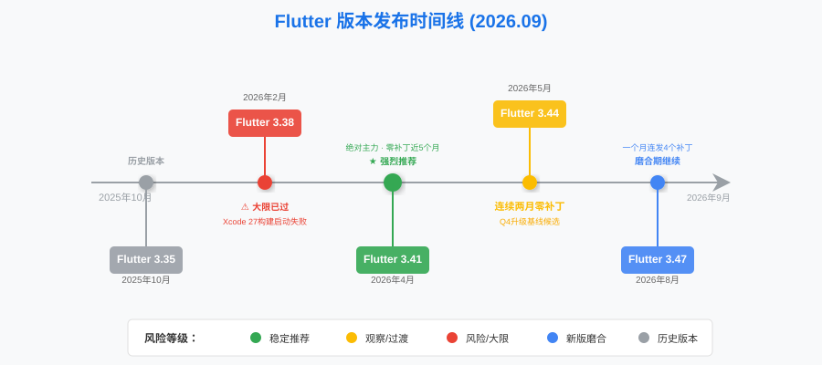
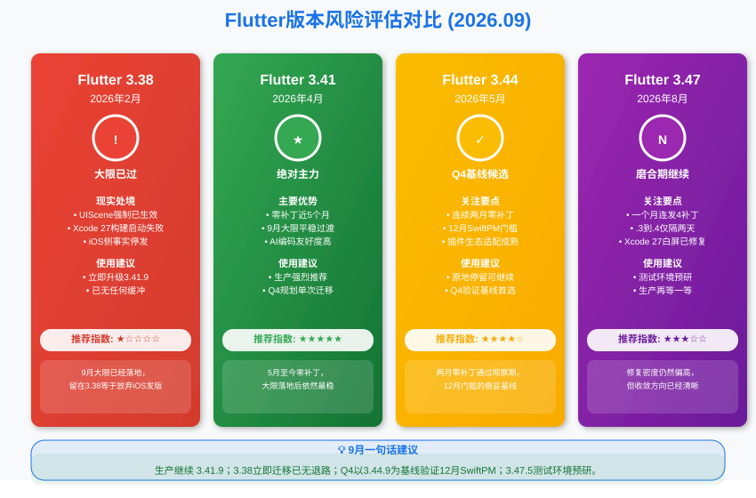
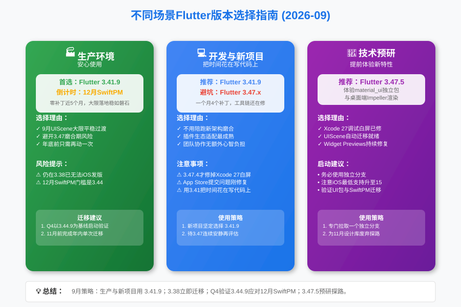

**大家好，我是老刘**

上个月说"升级Flutter版本，9月再说"的那位兄弟，这个月没再说话。iOS 27和Xcode 27如期而至，UIScene生命周期正式成为强制要求，留在3.38的App用Xcode 27构建，直接启动失败。

3.41.9的零补丁纪录走到了第五个月，3.44连续两个月安安静静，3.47则一个月连发四个补丁，在磨合的路上一路狂奔。照例，我们先把9月的版本情况捋清楚，再说接下来该干什么。

***

## 一、9月Flutter大事件

### 9月大限正式生效

iOS 27 SDK强制要求UIScene生命周期，这件事从年初讲到现在，终于从"倒计时"变成了"现实"。

用Xcode 27构建却没有采用UIScene的应用，启动会失败。Flutter这边的门槛还是那条线，3.41及以上由CLI在构建时自动迁移，3.38及以下出局。

上个月我说"门关到只剩一条缝"，这个月可以换个说法了。**门已经关上了，还在门外的人，问题已经变成"还能不能发版"。**

### 3.47一个月连发四个补丁

8月28日到9月19日，3.47连发.2、.3、.4、.5四个补丁，Dart也从3.13.1一路跟到3.13.4。其中3.47.3和3.47.4之间只隔了两天，属于典型的紧急追发。

老刘挑几个有代表性的修复。

- 3.47.2修复掉了启用SwiftPM时的iOS/macOS构建失败，顺带修复了一个libpng安全漏洞，还有Windows外接纹理崩溃和Linux触摸事件内存泄漏
- 3.47.3修复了一个框架级问题，`Actions.handler`在所有平台上恒定返回null，这种核心API出bug，说明磨合还没到底
- 3.47.4就是那波两天紧急追发，修复的是Xcode 27调试白屏卡死好几分钟，以及打包原生资源的App在App Store提交失败。iOS发版季出这种问题，官方比谁都急
- 3.47.5继续收尾，修复iOS 27真机调试偶发崩溃和Widget Previewer的崩溃

对比8月"一周修了12次"的慌乱，9月的修复重心明显从框架级转向了工具链和调试体验。**方向在收敛，但一个月四个补丁的密度，离"安静"还差得远。**

### 3.44连续两个月零补丁

另一边，3.44在8月7日的3.44.9之后再也没有动静，安静期已经拉到七周。

8月我把它挡在生产主力门外，理由是观察窗口太短。现在窗口拉长了一倍，而且12月SwiftPM强制的门槛恰好就是它。3.44的身份，正在从"过渡版本"变成"Q4必答题"。

***

## 二、Flutter最近5个版本深度解析（9月更新）

### 1. 版本列表

先看一张核心版本演进图。

| Flutter大版本 | 最近补丁发布日期 | Dart主版本 | 说明 |
| :--- | :--- | :--- | :--- |
| **3.47** | 2026年9月19日（3.47.5） | Dart 3.13.4 | 一个月4补丁，磨合继续 |
| **3.44** | 2026年8月7日（3.44.9） | Dart 3.12.2 | 连续两月零补丁，Q4基线候选 |
| **3.41** | 2026年5月1日（3.41.9） | Dart 3.11.5 | **当前推荐的生产环境主力版本** |
| **3.38** | 2026年2月12日（3.38.10） | Dart 3.10.9 | 大限已过，iOS侧事实停发 |
| **3.35** | 2025年10月23日（3.35.7） | Dart 3.9.2 | 彻底过时 |

### 2. 核心版本分析

**Flutter 3.47.5 - 磨合期继续，曙光已现但还没天亮**

- **状态**
**非生产环境使用，测试环境预研。**

- **评价**
一个月四个补丁听起来吓人，但拆开看内容，性质在起变化。8月修复的是构建失败、代码注入这种"能不能用"的问题，9月修复的更多是调试白屏、提审失败这种"顺不顺手"的问题。修复重心在下移，这是收敛的信号。

但信号归信号，3.47.3里那个`Actions.handler`返回null的框架级bug提醒我们，核心层的坑还没踩完。

- **策略**
预研团队跟进到3.47.5，重点场景重新跑一遍，特别是Xcode 27下调试和App Store提审这两条路，3.47.4刚修复过，值得验证。生产团队继续等，等它连续安静一个月以上再谈。

**Flutter 3.44.9 - 两月零补丁，晋级Q4基线候选**

- **状态**
**已具备主力资格，Q4验证基线的首选。**

- **评价**
8月我给3.44的评语是"够格但不值得专门动一次"，核心理由是观察窗口太短。现在连续两个月零补丁，窗口翻倍，而且12月SwiftPM的门槛就卡在3.44，它的战略地位完全变了。

8月我说的三点顾虑，"迁移次数最少"和"证据标准"这两条依然成立，所以生产主力这个月还是3.41.9。但"定位尴尬"这条已经被时间化解了，3.44不再是风暴眼里的过渡版本，而是年底之前最稳妥的落脚点。

- **策略**
还在3.44.9的团队，安心住着，12月之前你们什么都不用做。在3.41.9的团队，Q4把3.44.9作为基线启动SwiftPM验证，11月之前完成这一次迁移，年内就彻底交差。如果届时候3.47已经稳定，一步跳到3.47也成立，但别为了等3.47把验证拖进12月。

**Flutter 3.41.9 - 主力**

- **状态**
**强烈推荐生产环境使用。**

- **评价**
5月1日至今，零补丁纪录逼近五个月。9月大限落地这一周，升级到3.41.9的团队平稳过渡，UIScene自动迁移没有掀起任何波澜。事实再次证明，提前一个季度布局的人，大限当天只是普通的一天。

**Flutter 3.38.10 - 讣告**

- **状态**
**iOS侧事实停发。**

- **评价**
从2月的"建议规划"，到7月的"窗口关闭"，到8月的"最后通牒"，这个版本我追杀了半年。9月之后没什么好说的了，用Xcode 27构建启动就会失败，留在3.38等于放弃iOS发版。

- **策略**
如果因为各种原因还困在3.38，直接以3.44.9为目标做迁移，一步到位连12月的门槛一起过。别再问能不能先升3.41过渡，你没时间迁两次了。

***

## 三、9月版本选择建议

#### **生产环境（Stable Production）**

- **推荐**
**Flutter 3.41.9**

- **理由**
零补丁纪录近五个月，9月大限平稳过渡，稳定性没有任何对手。3.47还在一个月四补丁的磨合期，3.44虽然安静了两个月，但8月定下的标准没变，生产主力只看"长期零补丁+生态完全消化"。年底前再动一次，目标是3.44.9或届时已稳定的3.47。

#### **开发环境与新项目（Development & New Project）**

- **推荐**
**Flutter 3.41.9**

- **理由**
3.47.4才刚修复掉Xcode 27调试白屏和App Store提审失败，这类"发版季专属"的坑，谁踩谁知道。新项目要的是把时间花在写代码上，不是帮官方做排雷兵。

#### **技术预研（Tech Exploration）**

- **推荐**
**Flutter 3.47.5**

- **理由**
Xcode 27白屏已修复、提审链路已通，预研的体验比8月好了一个档次。11月设计库废弃、12月SwiftPM强制，这两道坎最终都要靠3.47趟平，现在跟进正是时候。

***

## 四、两个倒计时和一个复盘

9月大限翻篇了，桌面上的倒计时从三个变成两个，外加一个值得做的复盘。

### 1. 9月UIScene强制迁移复盘

给已经过关的团队布置一道作业。拿Xcode 27正式版完整走一遍构建、调试、提审流程，确认三件事，应用启动正常、AppDelegate自定义代码没有残留旧生命周期逻辑、插件里没有挂在旧生命周期上的实现。

大限当天不出事，不代表角落里没有雷。这次复盘攒下的经验，11月和12月还要再用两次。

### 2. 距离设计库废弃还有两个月

3.47开始，Material和Cupertino有了独立的pub.dev包，SDK内置版本将在11月秋季版正式废弃。

- 迁移工具已经就位，`dart fix --apply --code=migrate_design_widgets`
- 过渡期可以用`MaterialUiCompatibilityBridge`兼容桥，自己的代码先迁，依赖里的旧引用后面慢慢清

**建议**

10月是动手的最佳窗口。在3.47预研分支上先跑一遍`dart fix`，把阻塞项列出来。记住8月那条原则，一次只动一件事，设计库迁移别和SwiftPM迁移揉在一起。

### 3. 距离SwiftPM强制迁移还有三个月

**最低要求**
Flutter 3.44

- 官方数据里Top 100 iOS插件的SwiftPM迁移率已经超过九成
- CocoaPods进入维护模式，未迁移的插件在pub.dev上持续降分

**建议**

本月就把依赖清单过一遍，没迁移的插件列出来，能换的换，不能换的去提issue催。Q4以3.44.9为基线做完整验证，11月前完成迁移。别把这个能从容做完的事，拖成12月的火烧眉毛。

### 4. AI工具链的持续进化

Widget Previews转正之后还在密集修复，3.47.5刚修复掉预览器的一个崩溃，GenUI也在持续迭代。工具链越修越顺，AI辅助开发的体验差距会越拉越大。

老刘维持之前的判断：**能熟练使用AI工具的开发者，产出效率和不用AI的完全不是一个量级。**到年底这个差距只会更明显。

***

## 总结

9月的Flutter社区，最大的变化是大限从"将来时"变成了"完成时"。3.38出局，3.41.9平稳过关，3.44用两个月的安静换来了Q4基线的资格，3.47则在四个补丁里一点点磨掉棱角。

老刘建议：**生产环境继续坚守3.41.9，Q4以3.44.9为基线启动验证、11月前完成年内最后一次迁移；困在3.38的直接跳3.44.9，一步到位；预研团队跟进3.47.5，替大家把11月和12月的路提前趟平。**

9月的墙已经塌过了，没砸到提前搬家的人。11月和12月还有两面墙，现在搬，来得及。

> 🤝 如果看到这里的同学对客户端开发或者Flutter开发感兴趣，欢迎联系老刘，我们互相学习。
>
> 🎁 点击免费领老刘整理的《Flutter开发手册》，覆盖90%应用开发场景。
>
> 🚀 [覆盖90%开发场景的《Flutter开发手册》](https://mp.weixin.qq.com/s/6FeO9IoHbEuM-vhISitUxw)

> 📂 老刘也把自己历史文章整理在GitHub仓库里，方便大家查阅。
> 
> 🔗 <https://github.com/lzt-code/blog>
