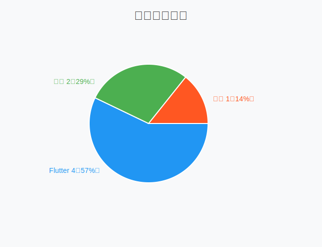

---

**哈喽，我是老刘**

当各大上市公司忙着晒三季度财报时，老刘也整理了一下三季度的项目情况。

4个Flutter、2个原生、1个鸿蒙，这个比例能否折射出一些客户端的技术选择逻辑？鸿蒙项目为何半路夭折，甲方爸爸付了一半钱就跑路？原生开发真的老了吗？

今天老刘带你看看真实的企业开发里的技术选择逻辑。

这里我们不空谈理论，而是智能选择最实用成本最低的技术方案。

## Flutter 4/7 的占有率不是偶然

先说结论：Flutter能占到4/7，真不是老刘偏心，而是市场用脚投票的结果。

**公司内部项目，2个都是Flutter**

第一个是公司主力App，已经跑了6年，老刘入职前就在。

我入职后开始负责从原生代码迁移到Flutter，目前还是原生 + Flutter的混合开发状态，估计这种状态还会持续很长时间。

为啥不一次到位？因为迁移成本高而且没必要。

但是新功能全用Flutter开发，老功能会逐步完成替换。

最终的状态会是大部分功能都用Flutter实现了，只有一些底层功能长期保留在原生代码中。

第二个是小项目，面向普通用户。

直接Flutter开干，没有犹豫。

因为团队熟悉，开发效率高，一套代码多端运行，这买卖划算。

**外包客户项目，2个也都是Flutter**

第一个最有意思：客户直接指定Flutter，老刘从0到1搭建，交付后客户自己维护。

客户有开发团队，也知道Flutter是趋势，但缺乏大型项目经验。找老刘搭好框架，核心功能开发完，后续自己维护。

这不是能力问题，而是成本考量——传统行业不想养大型客户端团队，外包主体部分，留少数人维护升级。

第二个讨论了3轮设计和技术方案，客户最终接受建议用Flutter。

也是传统行业，但用户是非专业人员，典型的外包项目。

其实这种情况是最普遍的，客户这边没有专门的客户端开发团队。

你给他们讲哪个技术更先进其实他们是不太了解的。但是Flutter只需要一份开发人员，这个他们是很喜欢的。

**这不是技术选择，是商业选择**

企业不care你用什么技术，他们只关心开发快不快？稳定不稳定？后期维护麻烦不麻烦？

Flutter刚好满足了这些需求。

4/7的占有率不是偶然，这是市场选择的结果，是企业用脚投票。

## 原生开发的不可替代性

这两个项目比较类似，都是基于Android端的pad进行数据展示的，只是展示的数据源好样式不一样。

这两个都是比较小型的项目，基本上投入2~3人几天就完成了。

其中第一个客户本来有意向使用Flutter进行开发，但是考虑到数据获取部分已经有原生的代码支持，而且UI方面的功能相对非常简单，所以老刘就建议客户先用原生了。

有些时候没必要提升整个架构的复杂度，保持简单，成本也会更低。

如果后续有更大规模的功能需求，再考虑是否迁移到Flutter或者切换到混合开发。

第二个其实就是延用第一个的技术方案，所以直接给客户建议使用原生开发。

**混合开发是更普适的方案**

老刘现在做的项目，很多都是混合开发。

Flutter负责业务逻辑，原生负责底层能力。

各取所长，谁也不抢谁的饭碗。

原生开发不会死，它只是变得更专精了。

就像现在还有人在用C语言写驱动一样。

技术不会消失，只会找到自己的位置。

## 鸿蒙项目翻车现场

这个项目说来话长，简直是教科书级别的"客户跑路"案例。

原本是个PC端项目，客户领导说要在鸿蒙上开发个版本试试水。

方案讨论的挺明白：我们负责UI和业务逻辑，底层数据通信和文件处理客户自己搞定。

主要是底层有一些客户自己的逻辑，不方便外包的。

结果项目开发了一大半了，客户那边开发的底层出了不少问题，那边找了个借口就放弃了。

最后协商结果：客户付一半钱，项目结束。

说白了就是烂尾了，甲方爸爸付了一半钱跑路。

话说这种“领导想试试水”的项目从一开始就有种不祥的预感。

另一方面把一个平台的应用的底层代码迁移到另一个平台也确实是一个比较复杂的任务。

对一些不是很熟悉的团队来说，确实有可能会遇到不少问题，然后发现实际的项目周期和需要的资源比预定的计划要超出很多。

## 这3个坑，老刘踩过，你别再踩了

1. **Flutter不是银弹**

我们团队目前最熟悉的技术栈是Flutter。

因此习惯性的会更优先的选择Flutter作为项目的技术栈。

但是在一些底层依赖原生功能的场景下，Flutter + 原生的混合开发模式确实也会增加项目的复杂度。

这时候一定要综合考量各种因素，比如项目的规模、客户的后期维护需求、项目的时间周期等等，有时候直接选择原生可能是最好的。

总的原则是简化问题，除非有明确的需求，否则不要过度设计。

等项目规模扩大，或者客户有更复杂的需求，才考虑是否迁移到Flutter。

2. **鸿蒙生态还不成熟**

偏底层功能迁移需要预留多一些时间和资源。

避免项目的周期超出预期，这是一个比较大的风险。

3. **外包项目要做好预期管理**

和大公司合作一般比较稳妥，而且客户一般也会有自己的技术团队，维护成本会比较低。

小机构和个人的项目，前期一定要做好沟通和异常情况的说明。

很多小项目，尤其是个人项目，客户想象中的开发进度时很美好的。

但是现实总会和预期有很大的差距。

为了避免后期扯皮，前期的需求规格说明、设计文档等交付一定要非常详细，把可能的异常情况和处理方案都列出来。

这可以避免后期因为沟通不及时导致的项目的问题。

## 总结

回顾这7个项目，4个Flutter、2个原生、1个鸿蒙夭折。有这么几点感想：

- Flutter不是万能的，但在多数场景下确实是最优解。
- 原生开发不会消失。
- 鸿蒙很有潜力，但生态成熟需要时间。

总的来说就是一句话，**合适的技术才是最优解。**

如果看到这里的同学对客户端开发或者Flutter开发感兴趣，欢迎联系老刘，我们互相学习。
点击免费领老刘整理的《Flutter开发手册》，覆盖90%应用开发场景。
可以作为Flutter学习的知识地图。

[覆盖90%开发场景的《Flutter开发手册》](https://mp.weixin.qq.com/s?__biz=MzkxMDMzNTM0Mw==&mid=2247483665&idx=1&sn=56aec9504da3ffad5797e703c12c51f6&chksm=c12c4d11f65bc40767956e534bd4b6fa71cbc2b8f8980294b6db7582672809c966e13cbbed25#rd)