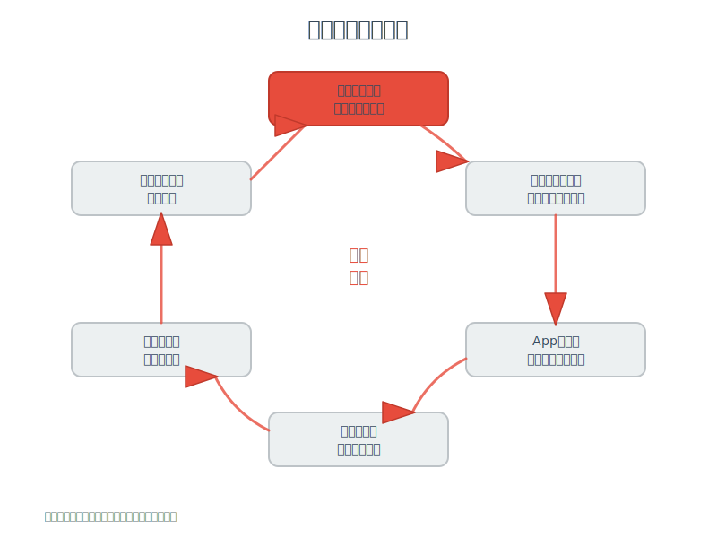

# Flutter官方拒绝适配鸿蒙的真相：不是技术问题，而是...

**哈喽，我是老刘**

老刘做Flutter开发快7年了，刚开始的时候还没有鸿蒙。

这两年随着鸿蒙系统相关的争议变多，讨论Flutter 在鸿蒙上的适配的争议也开始变多了。

比如前段时间写了一篇文章讨论用Flutter开发鸿蒙应用。

[Flutter 3.35倒逼鸿蒙：兼容or出局，没有第三条路！](https://mp.weixin.qq.com/s/9Mt4RiwLOl5uYTGW-EF-zQ)

就有人评论说应该是Flutter官方适配鸿蒙，而不是鸿蒙适配Flutter。

其实这么说也是有一点道理的（虽然不多），今天老刘就展开分析以下到底应该是谁来适配谁？

---

## 从技术角度看：Flutter确实应该主动适配鸿蒙

Flutter作为跨平台框架，它的核心价值就是"一套代码，多端运行"。

如果不能适配重要平台，那就失去了跨平台的意义。

就像当年Flutter必须适配iOS和Android一样。

这不是谁求谁的问题，这是技术逻辑的问题。

Flutter从诞生那天起，就打着"Write once, run anywhere"的旗号。

但是事实是Flutter官方确实没有表现出适配意愿。

---

## 现实情况更复杂：这是一个博弈过程

理想很丰满，现实很骨感。

技术逻辑是一回事，商业逻辑又是另一回事。

在当前的经济形势下，各个企业去增加一个独立的鸿蒙团队的成本是难以接受的。

Flutter的价值就在于降低这种成本。

因此站在鸿蒙的角度，是应该主动适配Flutter的，而不是等待Flutter官方适配。

其实不仅仅是Flutter，主流的跨平台框架鸿蒙官方都有必要去主动适配。

这就像是一个新开的商场，你不能指望品牌商主动来入驻。

你得主动去招商，提供优惠政策，甚至免费装修。

**鸿蒙的困境：**

- 用户基数还很少，开发者投入意愿不强。
- 生态建设需要时间，短期内难以完全替代Android。
- 政策推动有限，最终还是要靠技术魅力。

**Flutter的考量：**

- Google作为Flutter的主导者，对鸿蒙的态度可能比较复杂。

    这个有国际形势的原因，具体背后有哪些权衡咱也不知道，咱也不敢说。

- 本质的原因是鸿蒙的体量还不够。

    就像当年微软的Windows Phone，技术再好，没有足够的市场份额，开发者就不会买账。

所以从谁受益的角度来看，明显鸿蒙方面去适配Flutter的收益更大。

---

## 鸿蒙已经在做Flutter适配

话说回来，其实鸿蒙方面已经在为包括Flutter在内的跨平台框架做适配了。

而且动作还不小。

### 关键时间线

让我们先看看这几年鸿蒙Flutter适配的关键节点：

**2021年1月** - 美团外卖MTFlutter团队率先突破。

发布《让Flutter在鸿蒙系统上跑起来》技术文章。

成为业界首次公开的Flutter鸿蒙适配探索。

这个时候鸿蒙还很早期，美团就开始尝试了，确实有前瞻性。

**2023年8月** - 华为在HDC大会正式发声。

发布HarmonyOS NEXT，确定第一批跨平台框架适配名单：
- Flutter
- React Native  
- 京东Taro
- uni-app

**2023年9月** - OpenHarmony-SIG组织正式开源Flutter适配项目。

基于Flutter 3.7版本进行适配。

这意味着适配工作从企业内部走向了开源社区。

**2024年8月** - 三方库适配取得重大进展。

深开鸿、开鸿智谷、鸿湖万联完成36个Flutter三方库适配。

其中9个完成测试验收。

### 具体适配工作有哪些

从技术层面来看，鸿蒙适配Flutter主要做了这几件事：

**嵌入层开发**

重新实现Flutter嵌入层以适配鸿蒙平台。

这是最核心的工作，相当于给Flutter换了一个"底盘"。

**Flutter Engine移植**

基于Android版本进行鸿蒙平台的移植。

这里有个巧妙的地方，鸿蒙系统延用了Android的很多技术方案。

比如Vulkan图形API。

所以把Impeller这样的渲染引擎移植过来，并不需要大动干戈。

**开发工具适配**

Flutter Tools支持构建HAP包。

这样开发者就可以用熟悉的Flutter命令行工具直接构建鸿蒙应用了。

### 生态建设的困局

但是，技术适配只是第一步。

真正的挑战在于生态建设。

简单来说就是：Flutter有了，但是三方库还没有完全适配好。

从技术原理来说，如果是纯Dart的三方库，适配起来应该比较简单。

大概率是能直接运行的，或者极少的修改就能运行。

但是如果涉及到原生代码的三方库，那就麻烦了。

需要重新适配Android/iOS的原生代码到鸿蒙平台。

这个工作量就比较大了。

而且很多三方库的维护者可能对鸿蒙平台并不熟悉，更没有去适配的意愿。

对鸿蒙上各种开发框架来说都是这样的，基础库的不完善造成了开发者移植app的困难，进一步造成了App数量的缺少，即使移植过来也可能是功能缺失的。

应用数量和质量都不够就很难快速提升用户量，用户量不够就很难吸引足够多的开发者。

这就形成了一个恶性循环。

---

## 总结

其实说到底，这也不能说是什么博弈。

任何一个跨平台框架都不可能去适配所有的系统。

就像Flutter也没有适配塞班、Windows Phone这些已经消失的系统一样。

反过来说，作为体量还不够大的系统，主动去提供更好的应用移植解决方案，确实是快速建立生态的最佳路径。

老刘作为一个开发人员，我觉得一个新的系统要想快速建立生态，其实更好的方案是向上提供一套和现有最流行系统（比如Android）兼容的系统级API。

这样大部分应用可以用最小的代价迁移到新系统上。

如果你真的觉得现有的系统API有很大的缺陷，也完全可以在现有API基础上做增量优化。

如果你的优化真的有很大先进性，随着开发者增加，自然有人会使用。

当然这只是开发者的角度。

很多事情也不是给开发者做的。

连API都是全新的全自主研发系统和兼容API的系统，对很多不懂技术的人来说还是有很大差别的。

另一方面，鸿蒙系统这种设计在智能家居、汽车等不太依赖现有生态的场景下，也有自己的优势。

毕竟在这些新兴领域，大家都是从零开始，没有历史包袱。

鸿蒙的分布式架构、万物互联的理念，在这些场景下确实有独特的价值。

所以，与其纠结谁适配谁，不如关注技术本身能解决什么问题。

Flutter适配鸿蒙也好，鸿蒙适配Flutter也好，最终受益的都是开发者和用户。

技术的发展从来不是零和游戏，而是共同进步的过程。

好了，如果看到这里的同学对客户端开发或者Flutter开发感兴趣，欢迎联系老刘，我们互相学习。
点击免费领老刘整理的《Flutter开发手册》，覆盖90%应用开发场景。
可以作为Flutter学习的知识地图。

[覆盖90%开发场景的《Flutter开发手册》](https://mp.weixin.qq.com/s?__biz=MzkxMDMzNTM0Mw==&mid=2247483665&idx=1&sn=56aec9504da3ffad5797e703c12c51f6&chksm=c12c4d11f65bc40767956e534bd4b6fa71cbc2b8f8980294b6db7582672809c966e13cbbed25#rd)
