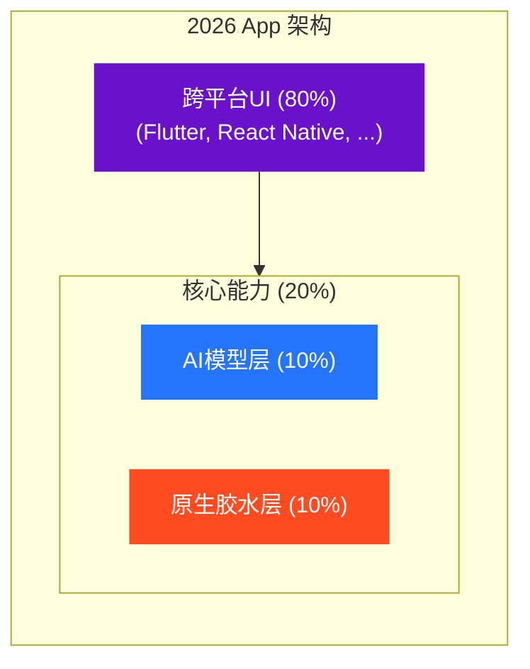
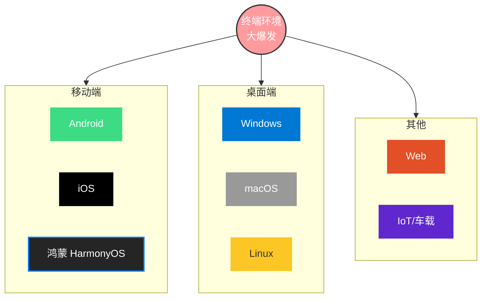
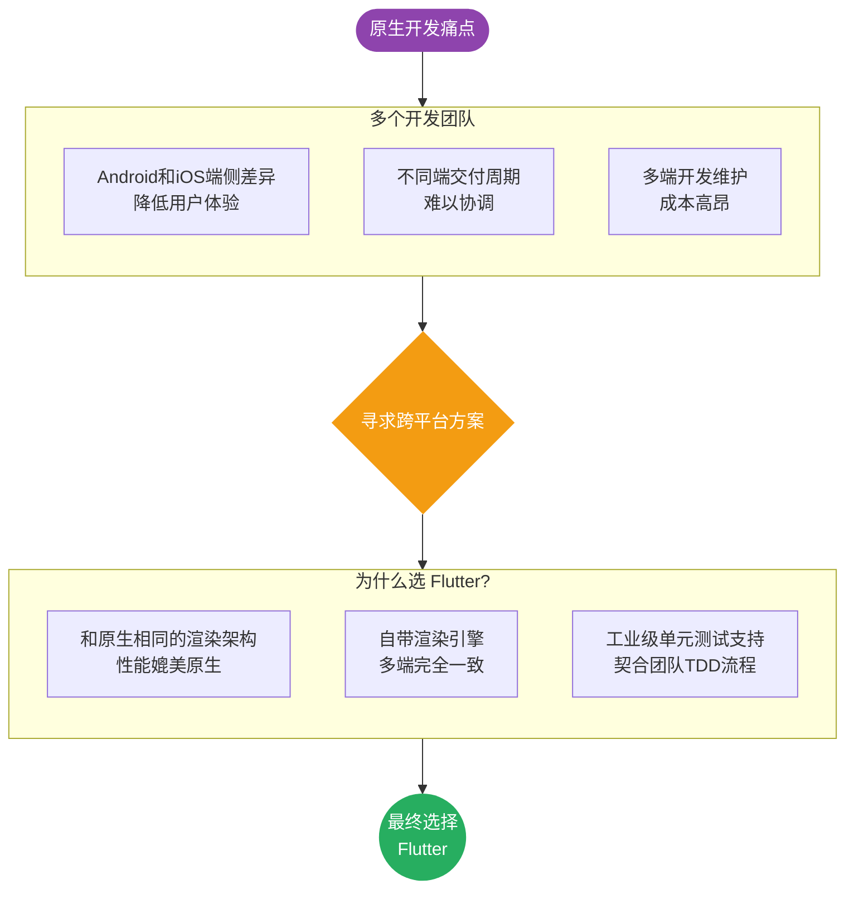

**大家好，我是老刘**

昨天有个老朋友找我喝酒，哭丧着脸。

这哥们是个五年的Android开发，技术那是没得说。

能独立完成复杂的系统模块，优化过千万级日活的App。

最近去面试一家大厂挂了。

面试官就问了一句：

“如果让你带队把这个模块迁移到鸿蒙和 iOS，除了重写三遍，你有什么低成本方案？”

他愣住了，他引以为傲的原生深度，在降本增效的大潮面前，就变成了一颗昂贵的螺丝钉。

2026 年，不知道有多少朋友又开始了或者将要开始投简历、面试的过程。

老刘借着这篇文章聊聊原生开发、跨平台开发在AI时代的客户端开发领域的生态位，以及作为开发者，我们该如何优化我们的技能树，以适应这个快速变化的行业。

---

## 原生不是死了，而是下沉了

别误会，我不是说原生技术要消失。

它只是下沉了，沉成了基础设施，就有点像汇编语言一样。

你看现在的 App 架构是啥样的？

如果你只守着那 10% 的原生胶水层，你的职业道路只会越走越窄。

最后变成公司里那个维护遗留代码的守门人，每天对着一堆陈年老代码叹气。

新人都在用新架构写新业务，你在角落里修改哪些该死的兼容性 Bug。

---

## Flutter vs 原生

这里老刘不想讨论技术参数的差异，而是想站在开发者的角度，谈谈聚焦不同的技术栈对我们有什么影响。

很多坚持“纯原生”的兄弟，理由往往只有一个：

“原生体验更好，性能更强，跨平台总觉得有点卡。”

听着挺有道理，但在 2026 年，这更像是一个给自己寻找舒适区的借口。

**现在的跨平台技术，早已经不是当年的“缝合怪”了。**

以 Flutter 为例， Impeller 引擎的成熟，让它的渲染性能在大多数业务场景下，已经做到了和原生毫无差异的程度。

你还在纠结那个滚动条的阻尼感是不是差了 0.01 秒，老板在纠结为什么隔壁组用一套代码已经上线了三个平台，而你还在为 iOS 的一个布局错位调了一下午。

**未来的核心竞争力，是端抽象的能力**

当你站在跨平台的角度进行开发，你思考问题的维度就变了：

- 你不再是“那个写 Android 的”，你是“那个能搞定全端交付的”。
- 你不再关心某个系统的私有 API，你开始关心如何设计一套通用的组件库，让业务逻辑在各个端之间无缝流动。

这种“端抽象”的能力，才是跨平台开发者真正的护城河。

---

## 跨平台（Flutter）不是加分项，而是及格线

以前面试，你会 Flutter是加分项。

现在那是及格线。

看看现在的终端环境，乱成一锅粥了：Android、iOS、鸿蒙、web、桌面端...

你指望老板招 5 拨人去维护 5 套代码？

老板根本不在乎你用原生还是Flutter，老板只在乎能不能把团队裁到只有一个人，然后你把所有的工作搞定。

只会纯原生等于把自己锁死在一个平台上。

一旦那个平台没落了，或者公司业务调整不做了。

想想当年的塞班开发，甚至前几年的 Windows Phone 开发，是不是背脊发凉？

---

## 你是不是那个解决问题的人？

其实不管是团队的技术方案选择，还是开发者个人技能树的升级，技术栈的选择从来都不仅仅是技术参数的对比。

**站在团队的角度**，老刘当年选择Flutter的原因有以下几个方面：

**站在开发者个人的角度**，你需要保证自己的技能树中点出来当前主流的技术方向。

我不是说一定要学Flutter或者某一个技术，而是你要知道现在在行业内大家都在用哪些技术。

而被大量企业和团队选择的技术栈大概率是当前最能解决实战问题的，或者是最具备性价比的选项。

为啥要做从众的选择？

因为商业社会你不能做那个掌握屠龙技的人，而要与做那个解决问题的人。

那什么样的技术路线能解决问题呢？

并不是你钻研最深入的，看起来参数最好的，而是你的同事都会用的。

不仅仅是你的同事，还是那些LLM比如Claude、ChatGPT甚至Kimi都能玩得转的。

---

## 换个活法，路宽得很

我建议你放弃纯原生，不是让你忘掉基础。

而是让你放弃那种画地为牢的心态。

不要做一个只会砌墙的泥瓦匠，要做一个懂结构的建筑师。

未来属于那些**站在原生肩膀上，用跨平台和 AI 俯视业务**的开发者。

别让技术栈限制了你的想象力。

更别让纯原生限制了你的身价。

共勉。

> 🤝 如果看到这里的同学对客户端开发或者Flutter开发感兴趣，欢迎联系老刘，我们互相学习。
> 
> 🎁 点击免费领老刘整理的《Flutter开发手册》，覆盖90%应用开发场景。
> 
> 🚀 [覆盖90%开发场景的《Flutter开发手册》](https://mp.weixin.qq.com/s?__biz=MzkxMDMzNTM0Mw==&mid=2247483665&idx=1&sn=56aec9504da3ffad5797e703c12c51f6&chksm=c12c4d11f65bc40767956e534bd4b6fa71cbc2b8f8980294b6db7582672809c966e13cbbed25#rd)
>
> 📂 老刘也把自己历史文章整理在GitHub仓库里，方便大家查阅。
> 🔗 https://github.com/lzt-code/blog
