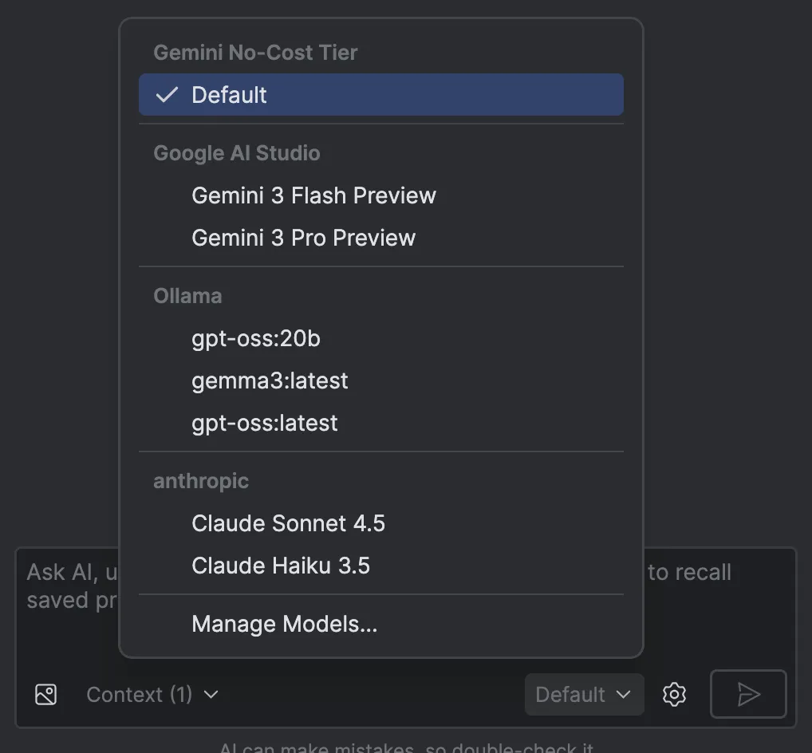
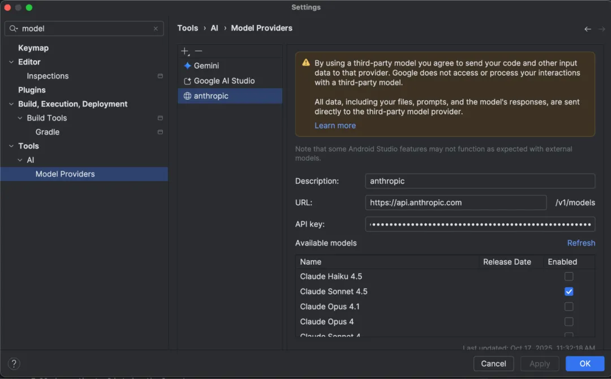
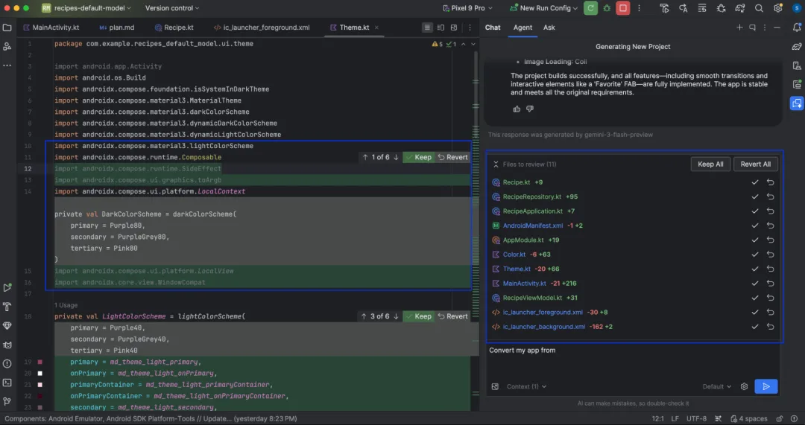
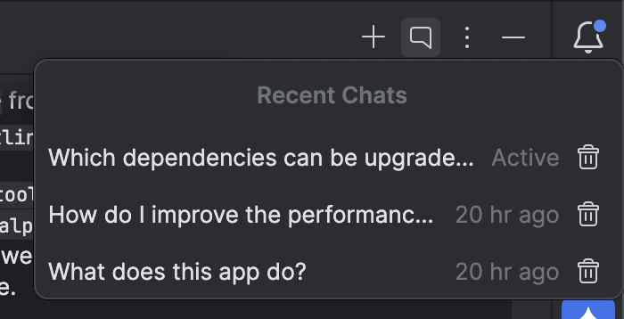
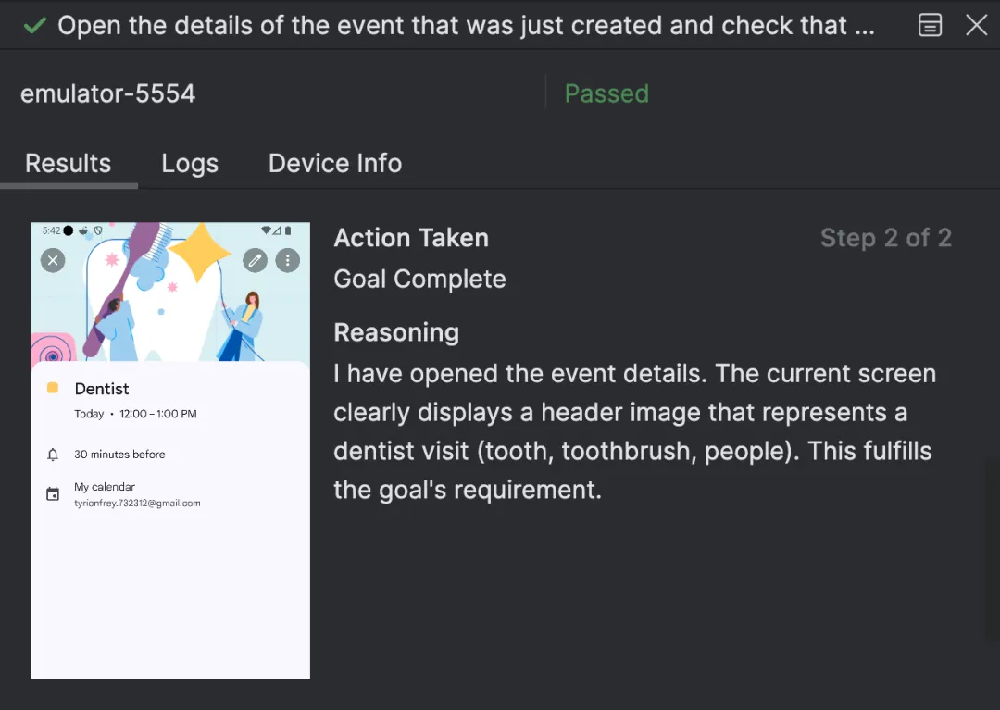

**大家好，我是老刘**

前几天Android Studio Otter 3 发布了。这看起来不是一个特别重大的新版本，但是对当前的客户端和Flutter开发者来说却是有着比较大的影响。

这也是为什么老刘做Flutter开发7年了，平时对sdk版本和IDE的升级并不积极，但是这个版本要单独说一下的原因。

我们先来看一下AS Otter 3做了哪些升级，然后来聊聊升级后的AS和Cursor这样的AI IDE相比，你该选谁。

# 一、Android Studio Otter 3 升级了哪些功能？

## 1. AI 模型灵活性与本地化

这是 AS 迈向开放的重要一步，不再局限于内置模型。现在AS终于向其它AI IDE看齐了。

**支持本地模型 (Local Models)** 

允许开发者通过 Ollama 或 LM Studio 运行本地 LLM（如 Llama 3, DeepSeek 等），满足隐私安全或离线开发需求。

很多大厂现在有这方面的规定，比如要求只能使用自家的AI IDE。

但是实际情况是对于Android开发或者Flutter开发来说，目前没有工具能完全替代AS在实际开发中的作用。

**支持自定义 Gemini API Key** 

开发者可以填入自己的 API Key，从而直接调用 Google 最新的 Gemini 3 Pro 和 Gemini 3 Flash 模型。

这样可以获得更大的上下文窗口（Context Window）和更高的配额，特别适合处理复杂的代码库。

**远程模型支持**

允许接入 OpenAI (GPT)、Anthropic (Claude) 等第三方远程模型，需配置 API 端点和密钥。

## 2. 智能体模式 (Agent Mode) 增强

AS 的 Agent Mode 变得更像一个全能结对程序员，具备了感知和操作设备的能力。

**设备交互与验证 (Device Actions)**

Agent 现在不仅仅是写代码，还可以 部署应用到设备 ，并看到屏幕内容、检查 Logcat 日志。

也就是说它可以在修改代码后，自动运行 App 并验证修复是否生效。

**变更抽屉 (Changes Drawer)**

新增了一个专门的面板来管理 Agent 产生的代码变更。

开发者可以查看所有修改的文件列表，通过 Diff 视图逐个审查、接受或回滚更改，解决了 AI 乱改代码难以追踪的问题。

**多线程对话 (Multiple Conversation Threads)**

支持同时进行多个独立的对话线程，避免不同任务的上下文混淆。

## 3. 开发与测试新体验

**Journeys (自然语言 UI 测试)**

需在 Studio Labs 中开启

利用 Gemini 的视觉和推理能力，开发者可以用自然语言编写端到端的 UI 测试。

Gemini 会将“点击登录按钮”这样的指令转换为实际的测试操作，并根据屏幕视觉内容进行断言，比传统的 View 查找方式更稳健。

**Logcat 自动 R8 反混淆**

在使用 AGP 9.0 (或 8.12+) 且开启 R8 ( minifyEnabled = true ) 时，Logcat 现在会自动还原（Retrace）堆栈信息，无需再手动使用命令行工具进行映射，极大方便了 Release 包的 Crash 排查。

话说这一点是老刘这样的企业开发者非常需要的，对于定位线上问题可以省不少事。

## 4. 支持AGP 9.0

下表列出了各个 Android Studio 版本需要的 AGP 版本。

| Android Studio 版本               |  AGP 版本 |
|----------------------------------|----------------|
| Otter 3 功能更新 \| 2025.2.3     | 4.0–9.0        |
| Otter 2 功能更新 \| 2025.2.2     | 4.0–8.13       |
| Otter \| 2025.2.1                | 4.0–8.13       |
| Narwhal 4 功能更新 \| 2025.1.4   | 4.0–8.13       |
| Narwhal 3 功能更新 \| 2025.1.3   | 4.0–8.13       |
| Narwhal 功能更新 \| 2025.1.2     | 4.0–8.12       |
| Narwhal \| 2025.1.1              | 3.2–8.11       |
| Meerkat 功能更新 \| 2024.3.2     | 3.2–8.10       |
| Meerkat \| 2024.3.1              | 3.2–8.9        |

# 二、日常开发选AS还是Cursor（Flutter 开发者视角） ？

于是一个问题就出现了：日常开发选AS还是Cursor / Trae 这样的AI IDE ？

## 1. AI IDE能完全替代AS吗（Flutter 开发者视角）？

比如老刘自己，近几个月来，用Cursor或者Trae的时间越来越多了。

其实这中间一个最重要的影响因素是性价比。

比如Trae 每个月10刀，虽然没有了Claude模型，但是Gemini 3 Pro 用起来也还是不错的。

这是目前老刘使用的最具性价比的方案了，而且还不用每次写代码都考虑网络问题。

Cursor 虽然要20刀，但是它的功能更加强大，而且可以用claude系列模型。

那么 Trae 或者 Cursor能完全替代AS吗？

**答案是否定的。**

根本原因在于AI在大型项目特别是企业项目的开发中还没办法完全替代程序员的作用。

### 个人开发和企业开发的差异（Flutter 开发者视角）

这可能是很多人的一个误区，觉得AI现在什么样的代码都能写出来，应该能代替大部分开发者了。

比如你可能一句话就可以利用AI写一个很漂亮的App。

但是实际上企业开发和很多个人开发者开发是完全不同的工作方式。

**对个人开发者来说**

重要的是看到需求和市场，然后利用AI快速实现想要的功能。

这种情况下只要AI写出来的代码功能正确，界面漂亮，那么就可以发布，然后再根据用户的反馈进行迭代。

比如你让AI写一个登录页面，他就能自动实现一个漂亮的登录界面，而且功能也比较完善。

**对企业开发者来说**

开发者需要100%的实现产品团队需求描述中的每一个细节。

UI上，你的每一个像素、每一个交互的细节，都需要100% 的还原UI/UE 设计，而不是用AI实现一个差不多的东西。

在功能逻辑上更是如此。

很多功能的细节是运营、产品、开发、测试多个团队的人坐在一起讨论出来的，虽然最后会落在需求规格说明书这样的文档中，但是文档毕竟没办法完全描述出每一个细节。

所以实际开发中有很多东西还是只存在于开发者的脑海中，或者是随时与产品团队进行沟通。

所以给AI一个需求说明文档，然后AI实现一个差不多的代码，是完全行不通的。

最后还是需要开发者自己去实现或者调整很多的细节。

在这种情况下特别是客户端项目中，不管是Android原生还是Flutter项目，AS对开发来说效率都会更高一些。

### AS在bug定位和性能分析方面更方便

AS 对 bug 定位和性能分析提供了更方便的工具和功能。

比如我们前面提到的这次AS更新的功能，**Logcat 自动 R8 反混淆**。

再比如，AS 还提供了性能分析工具，如 Profiler 可以帮助开发者分析应用的性能瓶颈，优化应用的性能。

虽然也有一些网页版的工具比如Flutter的dev tools，但是始终没有AS内部的顺手且方便。

## 2. 日常开发Flutter项目，老刘用啥工具？

日常开发Flutter项目的时候老刘到底是用Trae还是AS呢？

答案是两个都用。

### 方案设计用Trae

在真正开始写代码前，通常我会和AI讨论一下架构方案。

比如模块如何拆分，数据流如何设计等等。

### 大块代码用Trae

因为老刘工作中大部分的项目基础设施已经封装哈了，即使开新的App，大概率也会基于这些基础设施进行开发。

比如Flutter的状态管理、路由管理、底层数据库、服务端接口等等，都有现成的封装好的代码可以用。

所以我通常可以在项目的早期就进入业务逻辑的开发阶段。

这个阶段我主要用的是Trae，因为它便宜。

注意这里并不是说一次交给AI一个页面，让他一次性完成。

我会分成多个步骤。

比如先生成一个页面框架，把标题、页面结构、背景色等基本元素先写好。

然后将页面的具体内容分成几个模块。

每个模块单独让Trae实现。

比如先实现一个商品描述卡片，然后实现类似商品推荐卡片。

每个模块实现完后，先检查一下代码是否符合规范，是否有错误。

如果有错误，和AI进行沟通，然后一起解决。

这个过程中需要AI进行多次沟通，直到模块实现符合预期。

### 细节调整用AS

前面说了，AI没办法100%的完成需求的所有细节。

因此Trae实现的代码只是一个初始版本，需要开发者自己去调整和完善。

其中比较简单的问题直接在Trae中就修改了，比如布局问题。

有些问题和AI多次沟通都没办法很好的解决，比如一些比较复杂的交互逻辑。

这种问题可能就会放到AS中自己去实现。

但是这个切换不是很频繁。

比如今天主要用Trae实现大部分代码，那即使要自己写一些代码，就也会在Trae中完成。

等第二天上班想想今天的任务主要是自己写，那就会在AS中完成。

### bug修复主要用AS

代码完成提交测试后大概率会有一些bug（其实我们用TDD会避免很多bug，但没法做到完全没有）。

这种情况下定位bug可能更多的是在AS中。

以为经过TDD的验证，那些简单的bug是不会进入到测试环境的。

所以这个阶段收到的bug基本都是比较复杂的，比如那些难以复现的，或者难以定位的。

这种bug交给AI通常效果并不理想。因为AI并不能真正理解你的问题，它只是一个基于概率的模式匹配的机器。

所以在这种情况下，AS的bug定位和修复工具就会非常方便。

好了，总结一下就是现阶段AI并不能完全替代程序员完成开发工作，特别是在企业级项目的开发中。所以老刘自己目前的实际用法是Trae和AS混合使用。

# 三、为啥不提Claude Code？

到这里可能很多人有疑问，为啥没有提Claude Code这类开发工具？其实有两个原因

## 1. 基于终端的AI开发工具不限IDE

老刘觉得这是基于cli的开发工具最聪明的地方，避开了和各种IDE的直接竞争，可以无缝衔接到任何一个IDE中。

但是还是要说回来，CLI类的开发工具毕竟无法完全代替IDE。

就好像我们前面说的，现阶段在企业级开发中AI还没办法100%完成需求

既然还需要开发者的干预，那么就还是无法绕开IDE而完全切换到纯cli开发工具上。

## 2. 性价比不高

老刘用Claude Code的时间其实也不算短。总结Claude Code有两个问题

**第一个是官方账号太容易封号了。**

老刘自己被封了两个账号，身边的同事也基本都有中招的。

这就造成了用起来很不稳定，而且提心吊胆的。

所有第二个账号被封后，老刘就直接转用国内的API代理了。

**第二个是价格较高**

其实claude官方账号本身订阅就不便宜。

相信目前愿意给员工付费claude账号的公司寥寥可数吧？

如果让员工自己买，那相当于付费上班了，这个对大多数牛马来说估计是不会干的。

所以官方订阅其实更适合那些独立开发者。

比如如果老刘去写后端代码，因为我自己也不熟，所以可能就需要和通过AI进行反复的修改。

这时候官方的订阅基本上能锁定一个封顶的价格，总的来说就还是比较合适的。

那国内的 API代理怎么样呢？

这个最大的问题是大多数代理都是按使用量收费，少有包月的，或者包月比官方还贵。

按使用量的话，老刘建议不要轻易尝试，基本上是 几美刀每小时的样子。

# 四、总结

总的来说Android Studio Otter 3 的发布，标志着官方 IDE 在开放性和智能化上迈出了重要一步，特别是本地模型支持和 Agent 模式的增强，让它在专业开发领域依然稳固。

但在 AI 编程浪潮下，Cursor 和 Trae 等新兴 IDE 凭借极高的开发效率和性价比，正在重塑我们的编码习惯。对于开发者（尤其是 Flutter 开发者）来说，这并非是一场非此即彼的淘汰赛，而是一次工具箱的升级。

最聪明的做法是**博采众长**：

1.  **前期**：利用 **Trae** 等 AI IDE 的高性价比和快速生成能力，完成方案验证、框架搭建和大块业务逻辑的实现。
2.  **后期**：回归 **Android Studio**，利用其强大的调试工具、性能分析器和对原生环境的完美支持，进行细节打磨、Bug 修复和最终交付。

工具只是手段，效率才是目的。在这个 AI 快速迭代的时代，灵活组合使用不同的工具，各取所长，才是当下最高效的生存之道。

> 🤝 如果看到这里的同学对客户端开发或者Flutter开发感兴趣，欢迎联系老刘，我们互相学习。
> 
> 🎁 点击免费领老刘整理的《Flutter开发手册》，覆盖90%应用开发场景。可以作为Flutter学习的知识地图。
> 
> 🚀 [覆盖90%开发场景的《Flutter开发手册》](https://mp.weixin.qq.com/s?__biz=MzkxMDMzNTM0Mw==&mid=2247483665&idx=1&sn=56aec9504da3ffad5797e703c12c51f6&chksm=c12c4d11f65bc40767956e534bd4b6fa71cbc2b8f8980294b6db7582672809c966e13cbbed25#rd)

> 📂 老刘也把自己历史文章整理在GitHub仓库里，方便大家查阅。
>
> 🔗 https://github.com/lzt-code/blog