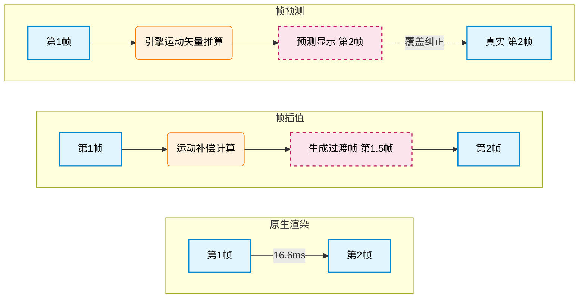

```mermaid
graph LR
    %% 样式定义
    classDef realFrame fill:#e1f5fe,stroke:#0288d1,stroke-width:2px,color:#000
    classDef fakeFrame fill:#fce4ec,stroke:#c2185b,stroke-width:2px,stroke-dasharray: 5 5,color:#000
    classDef calcNode fill:#fff3e0,stroke:#f57c00,stroke-width:1px,color:#000
    
    subgraph 原生渲染
        direction LR
        A1[第1帧]:::realFrame -->|16.6ms| A2[第2帧]:::realFrame
    end

    subgraph 帧插值
        direction LR
        B1[第1帧]:::realFrame --> Calc1(运动补偿计算):::calcNode
        Calc1 --> B1_5[生成过渡帧 第1.5帧]:::fakeFrame
        B1_5 --> B2[第2帧]:::realFrame
    end

    subgraph 帧预测
        direction LR
        C1[第1帧]:::realFrame --> Calc2(引擎运动矢量推算):::calcNode
        Calc2 --> C_Predict[预测显示 第2帧]:::fakeFrame
        C_Predict -.->|覆盖纠正| C2[真实 第2帧]:::realFrame
    end
```