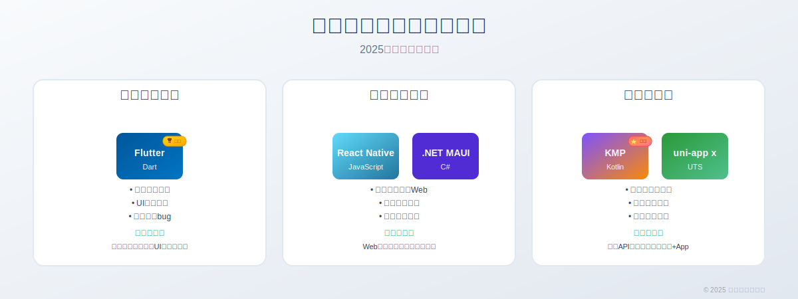
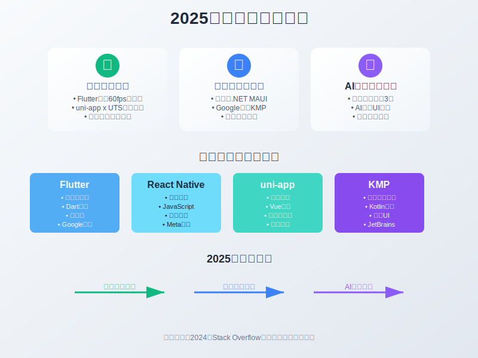
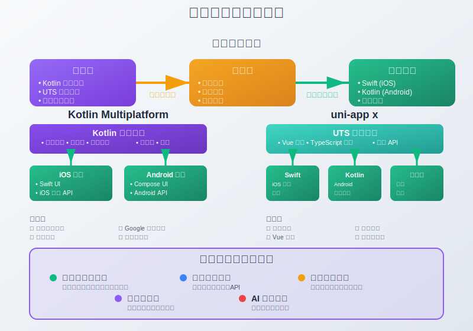
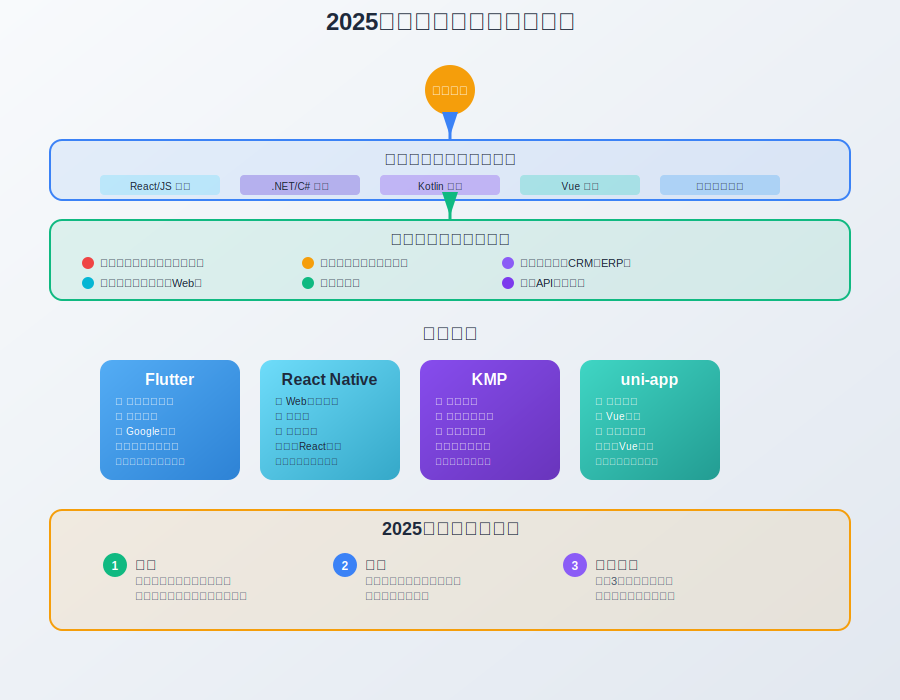

# 跨平台开发地图：客户端技术选型指南 | 2025年9月

**哈喽，我是老刘**

2024年，全球移动应用下载量突破2570亿次。

但开发者面临的问题是——平台越来越多。

以前只有iOS和Android，现在还有鸿蒙、Web、各种小程序...

每个平台都要单独开发，成本会翻好几倍。

不仅如此，用户对体验的要求越来越高。

他们希望在不同设备上看到一模一样的界面，享受一致的操作体验。

原生开发做不到这一点。

因为不同平台的设计规范、开发语言、UI组件都不一样。

这就给了跨平台开发巨大的机会。

可问题来了——市面上有十几种跨平台框架，每个都说自己是"最好的"。

Flutter说自己性能最强，React Native说自己生态最好，uni-app说自己平台最全，KMP说自己最接近原生...

选错了，就是几个月的坑。

选对了，团队效率起飞。

今天老刘画一张"跨平台开发地图"，告诉你2025年该怎么选。

## 一、2025年跨平台技术趋势

**第一个变化：性能差距在缩小**

以前大家总说跨平台性能不如原生。

但现在Flutter的自渲染引擎已经能达到60fps的流畅度。

uni-app x的UTS编译技术，直接把代码转成原生Kotlin和Swift。

性能差距已经小到用户感知不到的程度。

**第二个变化：大厂开始重注跨平台**

2024年5月，微软正式停止Xamarin支持，全力推.NET MAUI。

同年，Google官方开始支持Kotlin Multiplatform。

连苹果都在WWDC上提到了对跨平台开发的友好态度。

这说明什么？

连平台方都认可跨平台开发的价值了。

**第三个变化：AI加持下的开发效率暴增**

现在用Claude、ChatGPT写Flutter代码，效率比以前高了3倍。

特别是UI界面，直接描述需求就能生成可用的代码。

跨平台开发的学习门槛大幅降低。

接下来老刘按照跨平台技术框架的三种路线，分别介绍一下目前主流的跨平台技术。

## 二、自渲染类框架

**什么是自渲染？**

简单来说，就是框架自己画界面，不用系统提供的组件。

就像游戏引擎一样，每个像素都是自己控制的。

这样做有什么好处？

**第一，界面完全一致**

在iPhone上看到的按钮，和在Android上看到的按钮，一模一样。

同样的UI代码，在不同平台上运行，不会因为转嫁到系统的UI组件而导致展示效果不一致。

**第二，性能接近原生**

因为跳过了系统的UI层，直接操作GPU绘制。

本质上和原生系统框架采用相同的架构，因此性能上也不会有太大的区别。

**第三，没有兼容性bug**

其它两种方案不管是中间层还是转义，最终都会去调用系统原生的组件。

这个过程中因为不同系统的组件功能差异和实现方案不同就会导致一些兼容性问题。

其中比较复杂的问题可能需要你自己去原生代码的层面去定位和解决。

而自渲染的框架，因为跳过了系统的UI层，所以不会有这个问题。

### 2.1 Flutter

#### Flutter现在有多火？

2024年Stack Overflow调查显示，Flutter是最受欢迎的跨平台框架。

全球有超过500万开发者在使用。

连阿里巴巴、腾讯、字节跳动都在使用Flutter。

**为什么这么多大厂选择Flutter？**

**原因一：性能真的强**

自从切换了Impeller引擎，Flutter真的是和原生应用性能一致。

**原因二：开发效率高**

热重载功能让你改代码后，1秒钟就能看到效果。

不用重新编译，不用重新安装。

同时，Dart语言本身的在编码复杂性和功能性方面平衡做的非常好，日常开发的效率很高。

**原因三：生态成熟**

 pub.dev上有超过4万个插件包。

基本上你能想到的功能，都有现成的插件。

地图、支付、推送、数据库...应有尽有。

**原因四：对单元测试的良好支持**

Flutter是目前为止客户端开发领域中对单元测试支持最好的框架。

这一点比原生开发都要好，是Flutter独有的优势。

如果你的团队使用TDD或者敏捷流程，Flutter可能是最优选择。

**原因五：AI的积极跟进**

Flutter在AI时代的表现让人刮目相看。

Google官方推出了Flutter AI Toolkit，直接集成了Gemini API。

开发者可以用几行代码就实现AI聊天、图像识别、语音转文字等功能。

而且Flutter对AI模型的本地部署支持也很好。

TensorFlow Lite、ONNX Runtime都有官方插件。

你可以把AI模型直接打包到应用里，不依赖网络也能跑AI功能。

这在隐私要求高的场景下特别有用。

最近还有个新玩意儿——Dart MCP Server。

简单说，就是让AI助手能直接理解和操作你的Dart/Flutter项目。

你可以让AI直接帮你写Flutter代码、读取运行中的组件树、调试问题、优化性能。

总之，可以看到Flutter团队在对接AI方面的前瞻性和重视度。

#### Flutter适合什么项目？

**高性能应用**：比如游戏、音视频应用

**复杂UI应用**：比如电商、社交应用

**需要快速迭代的项目**：比如创业公司的MVP产品

**但Flutter也有坑**

**学习成本高**：需要学Dart语言，和JavaScript差别挺大

**包体积大**：最小的Flutter应用也要10MB+

**原生功能调用复杂**：需要写Platform Channel

**总结一下**

如果你的项目对性能要求高，UI比较复杂，团队有时间学习新技术。

Flutter是最佳选择。

特别是如果你们团队之前没有移动端开发经验，Flutter的学习曲线反而比原生开发更平缓。

## 三、中间层类框架

**什么是中间层框架？**

简单来说，就是在你的代码和系统原生组件之间，加了一个"翻译官"。

你用JavaScript写界面逻辑，框架帮你"翻译"成原生的Button、TextView。

这种方案有什么特点？

**第一，开发体验接近Web**

如果你的团队熟悉React、Vue这些Web框架，上手会很快。

基本上就是把Web开发的那套思路搬到移动端。

**第二，能调用原生组件**

最终渲染的还是系统原生的Button、Input。

所以界面看起来很"原生"，符合各平台的设计规范。

**第三，存在性能损耗**

因为有个"翻译"的过程，JavaScript和原生代码之间要频繁通信。

就像两个人通过翻译官对话，肯定比直接对话慢一些。

但这个损耗在交互不频繁的界面中，用户是感知不到的。

### 3.1 React Native

#### React Native的优势

**原因一：Web开发者的福音**

如果你会React，学React Native基本没有门槛。

同样的JSX语法，同样的组件化思想，同样的状态管理。

一个熟练的React开发者，一周就能上手React Native。

**原因二：生态系统超级丰富**

 npm上有超过15万个React Native相关的包。

导航、动画、图表、支付...你能想到的功能都有现成的库。

而且因为和React共享生态，很多Web端的库稍作修改就能用。

**原因三：热更新能力**

这是React Native的杀手锏功能。

发现bug？不用重新发版，直接推送补丁代码就能修复。

新功能上线？用户打开App就能看到，不用去应用商店更新。

这对产品迭代速度的提升是巨大的。

**原因四：Meta的持续投入**

2024年Meta发布了新架构（New Architecture）。

引入了Fabric渲染器和TurboModules，性能提升了30%。

同时推出了React Native 0.75版本，稳定性大幅提升。

#### React Native适合什么项目？

**快速迭代的产品**：比如社交应用、内容应用

**Web技术栈团队**：已经有React开发经验的团队

**需要热更新的应用**：比如电商、新闻类应用

**但React Native也有局限**

**性能瓶颈**：复杂动画和大量数据处理时，桥接开销明显

**原生功能依赖**：新的系统API需要等社区或自己封装

**版本升级成本**：大版本升级可能需要改很多代码

### 3.2 .NET MAUI

#### .NET MAUI是什么来头？

2024年5月，微软正式停止了Xamarin的支持。

.NET MAUI（Multi-platform App UI）成为微软官方的跨平台解决方案。

这不是简单的换个名字，而是架构的全面升级。

**MAUI相比Xamarin有什么改进？**

**第一，统一的项目结构**

以前Xamarin需要为每个平台创建单独的项目。

MAUI只需要一个项目，就能构建所有平台的应用。

**第二，性能大幅提升**

新的渲染引擎减少了50%的内存占用。

启动速度比Xamarin快了30%。

**第三，开发体验优化**

热重载功能让你改C#代码后，立即看到效果。

集成了最新的.NET 8特性，开发效率更高。

#### .NET MAUI的独特优势

**企业级支持**

微软提供长期技术支持（LTS）。

对于企业应用来说，这种稳定性保障非常重要。

**强大的数据处理能力**

C#在处理复杂业务逻辑方面有天然优势。

特别是金融、ERP这类数据密集型应用。

**与微软生态深度集成**

如果你的后端用Azure、数据库用SQL Server。

MAUI能提供最佳的集成体验。

#### .NET MAUI适合什么项目？

**企业级应用**：比如CRM、ERP、办公应用

**.NET技术栈团队**：已经有C#开发经验的团队

**数据密集型应用**：比如金融、医疗、教育管理系统

**但MAUI也有短板**

**学习门槛高**：需要掌握C#和.NET生态

**社区相对较小**：第三方库没有React Native丰富

**移动端特性支持滞后**：新的移动端API支持可能会慢一些

#### 中间层框架怎么选？

**如果你的团队主要是Web开发者**

选React Native，学习成本最低，生态最丰富。

**如果你的项目是企业级应用**

选.NET MAUI，稳定性和长期支持更有保障。

**如果你需要频繁的热更新**

选React Native，这是它的核心优势。

**如果你的应用数据处理逻辑复杂**

选.NET MAUI，C#在这方面更有优势。

**总结一下中间层框架的特点**

优势：学习成本低，能复用Web开发经验，界面原生感强。

劣势：存在桥接性能损耗，依赖第三方库封装原生功能。

适合场景：快速开发、团队技术栈匹配、对原生感要求高的项目。

## 四、转译类框架

**什么是转译？**

简单来说，就是把你写的高级语言代码，"翻译"成目标平台的原生代码。

比如你用Kotlin写业务逻辑，框架帮你"翻译"成iOS的Swift代码。

或者你用类TypeScript的语法写界面，框架帮你"翻译"成Android的Kotlin和iOS的Swift。

这种方案有什么特点？

**第一，性能最接近原生**

因为最终运行的就是原生代码，没有任何中间层损耗。

就像你直接用Swift写iOS应用，用Kotlin写Android应用一样。

**第二，能享受原生生态**

转译后的代码可以直接调用平台的所有API。

**第三，转译效果可能不完美**

毕竟是机器"翻译"的代码，有时候可能不如手写的原生代码优雅。

特别是复杂的业务逻辑，转译后的代码可能需要人工优化。

但这个问题随着AI技术的发展，正在快速改善。

### 4.1 Kotlin Multiplatform (KMP)

#### KMP为什么突然火了？

2024年是KMP的爆发年。

5月份，Google在I/O大会上宣布官方支持KMP。

以前KMP只是JetBrains的"个人项目"，现在有了Google的官方背书。

Android开发者可以放心使用，不用担心被抛弃。

**更重要的是，2025年KMP将推出Kotlin-to-Swift导出功能。**

你用Kotlin写的业务逻辑，可以直接转成Swift代码。

iOS开发者拿到的就是纯Swift代码，可以像原生项目一样调试和优化。

#### KMP的核心理念

**"业务逻辑用KMP共享，UI用Compose Multiplatform统一开发"**

这是KMP的最新发展方向，结合了Compose Multiplatform的强大能力。

传统的KMP是"业务逻辑共享，UI各平台原生"。

但现在有了更好的选择——Compose Multiplatform。

一套Compose代码可以运行在Android、iOS、Desktop、Web等所有平台。

业务逻辑用KMP共享，UI用Compose Multiplatform统一开发。

**这样做有什么好处？**

**第一，真正的一套代码多平台**

不仅业务逻辑共享，UI也可以共享，开发效率大幅提升。

**第二，保持原生性能**

 Compose Multiplatform在各平台都编译为原生代码，性能接近原生应用。

**第三，技术栈统一**

全部使用Kotlin生态，学习成本更低，团队协作更高效。

**第四，渐进式迁移**

你不需要重写整个应用，可以先从一个模块开始。

比如先把网络层用KMP重写，然后逐步迁移UI到Compose Multiplatform。

#### KMP + Compose Multiplatform适合什么项目？

**需要快速多平台发布的项目**

一套代码可以同时发布到Android、iOS、Desktop、Web等平台。

开发效率比传统KMP方案大幅提升。

**密集调用原生API的项目**

比如游戏、金融交易、实时通信应用。

KMP + Compose Multiplatform能提供真正的原生无缝调用。

**Kotlin技术栈的团队**

如果团队熟悉Kotlin和Jetpack Compose。

这个组合是最自然的选择，学习成本最低。

**已有原生应用的团队**

可以渐进式迁移，先迁移业务逻辑，再迁移UI。

风险可控，收益明显。

**但这个组合也有挑战**

**Compose Multiplatform在iOS还不够成熟**：目前还处于Alpha/Beta阶段

**学习成本相对较高**：需要掌握Kotlin和Compose

**生态还在建设中**：第三方库相对较少，但发展很快

### 4.2 uni-app / uni-app x

#### uni-app的进化之路

说到uni-app，很多人的印象还停留在"小程序开发工具"。

但2024年，uni-app发生了质的变化。

**传统uni-app**：基于Vue.js + JavaScript，更适用于小程序开发

**uni-app x**：全新架构，使用UTS语言，性能达到原生级别

这不是简单的版本升级，而是技术路线的根本改变。

#### uni-app x的技术突破

**第一，UTS语言**

UTS（UniTypeScript）是DCloud自研的编程语言。

语法类似TypeScript，但编译后直接生成原生代码。

Android平台编译成Kotlin，iOS平台编译成Swift，鸿蒙平台编译成ArkTS。

**第二，uvue渲染引擎**

这是uni-app x的核心技术。

不同于传统的WebView渲染，uvue直接调用原生渲染引擎。

性能和原生应用完全一致，没有任何损耗。

**第三，无桥接架构**

传统跨平台框架都有个"桥接层"，用来连接JavaScript和原生代码。

uni-app x直接编译成原生代码，完全没有桥接层。

这意味着没有跨语言通信损耗，性能达到原生级别。

**第四，直接调用原生API**

因为编译后就是原生代码，可以直接调用平台的所有API。

不需要等插件封装，新的系统功能立即可用。

#### uni-app x的独特优势

**平台支持最全**

这是uni-app的传统优势。

一套代码可以发布到：iOS、Android、Web、各种小程序、快应用、鸿蒙...

总共支持14+个平台，这是其他框架做不到的。

**小程序优先的设计理念**

如果你的产品需要同时支持App和小程序。

uni-app是唯一的选择。

其他框架都是"App优先"，小程序支持都是后加的。

**国产化支持**

对鸿蒙、信创等国产化平台支持最好。

这对国内企业来说非常重要。

**学习成本低**

如果你会Vue.js，学uni-app基本没有门槛。

语法、组件、生态都和Vue高度一致。

#### uni-app怎么选？

**传统uni-app适合：**

- 小程序为主的项目
- 快速多端发布需求
- Vue技术栈团队
- 对性能要求不高的应用

**uni-app x适合：**

- 需要原生级性能的应用
- 复杂交互的应用
- 需要调用大量原生API的项目
- 对包体积有要求的应用

**但uni-app也有局限**

**生态相对封闭**：主要依赖DCloud的生态

**国际化程度低**：海外开发者使用较少

**技术栈绑定**：主要适合Vue技术栈

#### 转译类框架怎么选？

**如果你有现有的原生应用**

选KMP，可以渐进式迁移，风险最小。

**如果你需要支持小程序**

选uni-app，这是它的核心优势。

**如果你对性能要求极高**

KMP和uni-app x都可以，看团队技术栈。

**如果你的团队是Vue技术栈**

选uni-app，学习成本最低。

**如果你的团队是Android技术栈**

选KMP，Kotlin是你们的强项。

**总结一下转译类框架的特点**

优势：性能最接近原生，能享受原生生态，没有运行时损耗。

劣势：学习成本相对较高，转译效果可能需要优化。

适合场景：对性能要求高、需要调用大量原生功能、有原生开发基础的团队。

## 五、技术选型：别再纠结了！这份选型指南让你秒懂

看了这么多框架，是不是更纠结了？

别慌，老刘给你一个简单粗暴的选型指南。

### 5.1 Flutter：大多数App的不二之选

其实对于大多数App来说，Flutter都是当前阶段最合适的选择

为什么这么说？

**性能足够强悍**

如果在大街上随机找100个人，把他们手机里面的非游戏类App都拿出来，那么其中99%都是Flutter可以胜任的。

对于性能有极端要求的App来说其实大概率原生开发也不行，需要更深度的优化方式。

比如把数据加解密、视频编解码等工作封装到更底层的so库中。

而这种优化方案在Flutter项目中也能使用，工作量和原生中差不多。

**开发效率够高**

Flutter的热重载功能，改代码后1秒内就能看到效果。

这比原生开发快了10倍不止。

而且Flutter的组件库非常丰富。

Material Design和Cupertino组件开箱即用。

对于更复杂的组件和绘制定制场景，由于Flutter自带渲染引擎，因此也可以直接在暴露给开发者的canvas上进行更复杂的渲染定制。

**TDD开发流程的完美搭档**

Flutter天生支持单元测试、集成测试、UI测试。

测试覆盖率可以轻松达到90%以上。

CI/CD集成也非常简单，GitHub Actions、GitLab CI都有现成的模板。

如果计划采用TDD相关的开发流程，Flutter可能是目前唯一的选择。

**AI时代的宠儿**

Google全力加持Flutter，AI工具链日趋完善。

GPT、Cursor、Claude Code对Flutter的支持都很好。

写Flutter代码，AI能帮你完成80%的重复工作。

**Flutter适合什么项目？**

- 需要高性能的应用（游戏、视频、图形处理）
- 对UI一致性要求高的应用
- 团队有充足的学习时间
- 需要长期维护的项目
- 对包体积不是特别敏感的应用

### 5.2 KMP：潜力股还是画饼？先别急着上车

**Kotlin Multiplatform：Google亲儿子的野心与现实**

KMP确实很香，但现在上车可能还早了点。

**现状分析：技术很香，但生态还在"襁褓期"**

KMP的技术理念非常先进。

但问题是——生态还不够成熟。

第三方库支持有限，很多常用功能需要自己封装。

调试工具也不够完善，出了问题排查起来比较麻烦。

**适用场景：密集调用原生API的项目可以关注**

如果你的应用需要大量调用原生API：

- 相机、麦克风、传感器
- 蓝牙、NFC、GPS
- 系统级权限管理

KMP确实有优势。

因为它可以直接调用原生代码，没有性能损耗。

**风险提醒：早期采用者需要踩坑的心理准备**

选择KMP，你需要做好这些准备：

- 遇到问题时，Stack Overflow上的答案可能很少
- 第三方库可能不支持，需要自己写原生桥接
- 团队需要同时掌握Kotlin、Swift、Android、iOS开发
- 项目初期开发效率可能不如Flutter

**未来展望：如果KMP真正成熟，将是原生开发的强力补充**

Google已经把KMP列为官方支持的技术。

JetBrains也在大力投入。

如果生态能在2025年下半年成熟起来，KMP确实值得考虑。

**建议：除非你是技术极客，否则再等等**

如果你的团队技术实力很强，喜欢尝试新技术，可以在小项目上试试KMP。

但如果你需要稳定可靠的解决方案，建议再等一年。

等KMP的生态更成熟一些，再考虑大规模使用。

### 5.3 App + 小程序：别被"一套代码走天下"忽悠了

**App和小程序一套代码？醒醒吧，这可能是个伪命题！**

很多人被"一套代码，多端运行"的口号忽悠了。

以为App和小程序可以用同一套代码。

但现实是——这样做可能得不偿失。

**思维误区：把小程序当App的"乞丐版"是大错特错**

很多人觉得小程序就是App的简化版。

功能少一点，界面简单一点，用户体验差一点。

这种想法完全错了。

App和小程序应该承担不同的产品职责。

**正确姿势：App和小程序应该承担不同的产品职责**

App的优势：
- 性能更好，可以做复杂交互
- 可以离线使用
- 推送通知更及时
- 用户粘性更高

小程序的优势：
- 获客成本更低
- 分享传播更容易
- 用户使用门槛更低
- 可以借助平台流量

**成功案例解析：微信读书的智慧分工**

微信读书就是一个很好的例子。

**App承担重交互功能：**
- 长时间阅读体验优化
- 个性化推荐算法
- 离线下载功能
- 复杂的社交互动

**小程序专注营销拉新：**
- 好友推荐分享
- 读书打卡活动
- 限时免费活动
- 新用户引导体验

这样分工，App和小程序各司其职，效果比"一套代码"好得多。

**技术选型建议**

**功能重叠度高的情况：**

如果你的App和小程序功能重叠度超过70%，可以考虑uni-app等跨端方案。

比如电商类应用，商品展示、购物车、订单管理这些功能，App和小程序基本一样。

**功能差异化大的情况：**

如果App和小程序的功能差异很大，建议分别选择最适合的技术栈。

App用Flutter或原生开发，专注用户体验。

小程序用原生小程序开发，专注营销转化。

**避坑指南：不要为了技术统一而牺牲用户体验**

很多团队为了技术栈统一，强行用一套代码开发App和小程序。

结果App体验不如原生，小程序功能又太复杂。

两边都不讨好。

记住：技术是为产品服务的，不是为了技术而技术。

**总结一下技术选型的核心原则**

1. **大多数情况选Flutter**：性能、生态、开发效率都很均衡

2. **KMP可以关注但别急着用**：等生态成熟一些再说

3. **App和小程序要差异化定位**：不要被"一套代码"忽悠

4. **根据团队技术栈选择**：学习成本也是成本

5. **考虑项目的长期维护**：选择有长期支持的技术

## 六、总结与建议

写了这么多，老刘最后给你一个终极建议。

**2025年跨平台开发，记住这三个关键词：务实、聚焦、长期主义。**

### 务实：别追求完美的技术方案

很多团队陷入"技术洁癖"。

总想找到一个完美的跨平台方案，既要性能好，又要学习成本低，还要生态丰富。

醒醒吧，这样的方案不存在。

**每种技术都有trade-off。**

Flutter性能好但包体积大。

React Native生态好但有桥接损耗。

KMP接近原生但生态不成熟。

uni-app平台全但主要适合Vue技术栈。

**选择技术的核心是：在当前约束条件下，哪个方案的收益最大。**

不要追求完美，要追求合适。

### 聚焦：一个团队最多掌握两种跨平台技术

很多公司什么技术都想试。

Flutter也搞，React Native也搞，KMP也要研究。

结果每个都不精通，遇到问题都解决不了。

**建议：选定一个主力技术栈，最多再备一个备选方案。**

### 长期主义：技术选型要考虑3年后的维护成本

很多人以为选定技术栈就万事大吉了。

错！

技术选型只是万里长征第一步。

真正决定项目生死的，是你选定技术栈之后做的那些事。

**架构设计够不够清晰？**

模块划分是否合理，接口设计是否稳定，这些直接影响后续迭代的难度。

**开发流程够不够规范？**

CI/CD流水线、代码审查、测试覆盖率，这些看似繁琐的流程，3年后会救你的命。

**代码规范够不够严格？**

命名规范、注释规范、目录结构，新人能不能快速上手，老代码能不能看懂。

**技术债务管理够不够及时？**

每次为了赶进度留下的坑，3年后都会变成巨坑。

选定技术栈不是终点，而是起点。

做好这些基础建设，才是项目能持续健康演进的根本。

否则，再好的技术栈也救不了你。

### 最后的最后：技术选型没有标准答案

老刘写这篇文章，不是为了告诉你"必须选哪个技术"。

而是希望你在选择时，能有一个清晰的思考框架。

**2025年，跨平台开发已经不是"能不能做"的问题，而是"怎么做得更好"的问题。**

选对了技术栈，团队效率起飞。

选错了技术栈，就是几个月的坑。

希望这篇"跨平台开发地图"能帮你避开那些坑，找到最适合你的路。
